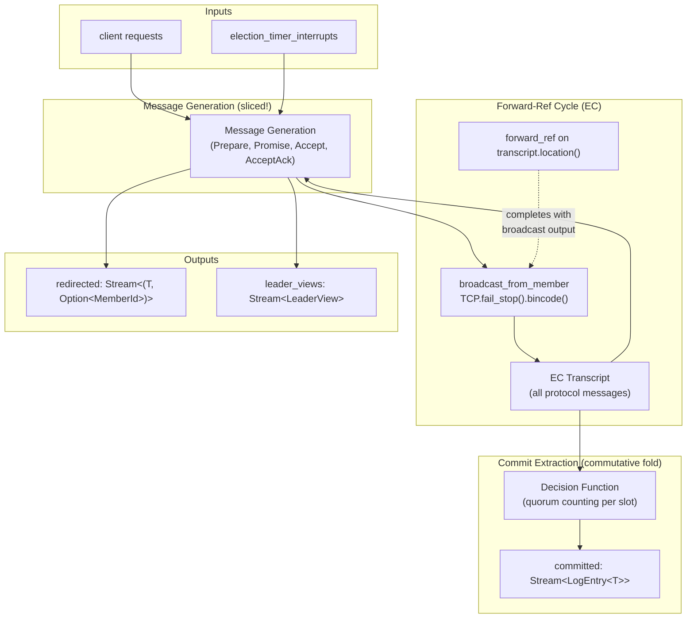
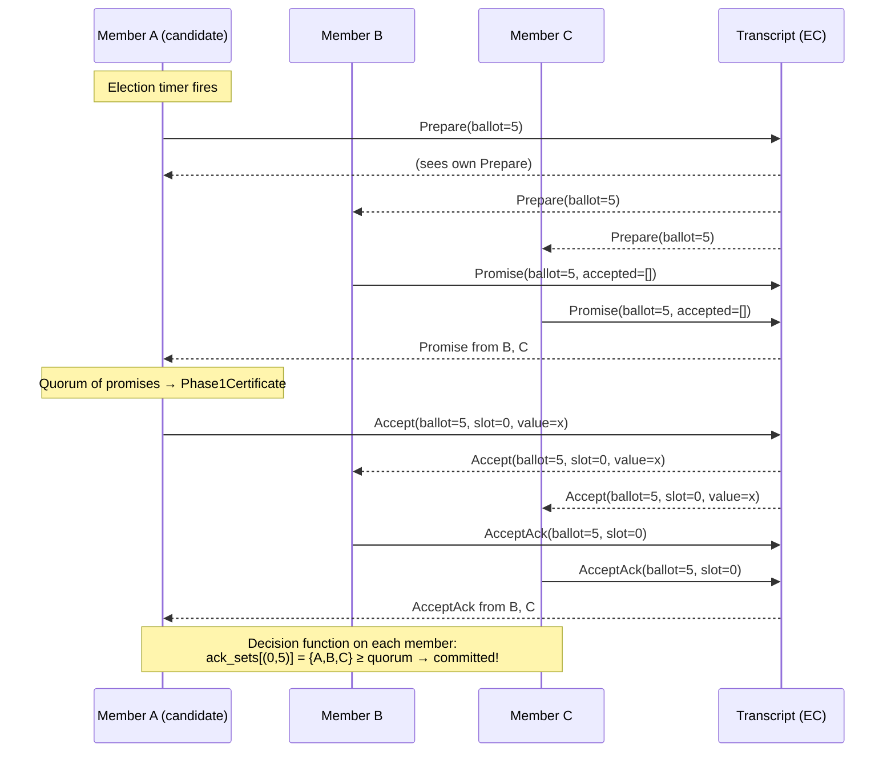

# Design Document: Broadcast Transcript Consensus

## Overview

This module implements consensus via the broadcast-transcript pattern: every protocol message is `broadcast_from_member` to all cluster members, producing an EC transcript visible to everyone, and each member independently folds that transcript with a commutative decision function to extract committed log entries.

The architecture is the `broadcast_consensus.rs` sketch made real — with Paxos correctness mechanisms (ballot fencing, quorum counting, Phase1Certificate recovery) bolted into the decision function. It is **not** the `paxos_ec` dual-path architecture (separate protocol loop + EC side-channel), and **not** the `raft_step` single-state-machine-per-tick approach.

**Key design decisions:**

1. **Single broadcast channel**: All message types (Prepare, Promise, Accept, AcceptAck) travel over one `broadcast_from_member` call. No per-message-type demux or separate channels.
2. **EC inferred, not asserted**: The `forward_ref` cycle trick from `reliable_broadcast` and `crdt_gossip` earns EC from transport policy. Zero `assert_has_consistency_of`.
3. **Two concerns compose**: Message generation (reactive) and commit extraction (commutative fold) are separate dataflow subgraphs that share the transcript stream.
4. **API-compatible with `raft_server`**: Same output type signatures (`committed`, `redirected`, `leader_views`), so tests and users can swap implementations.

## Architecture



### EC Inference Chain

The EC inference follows the exact pattern established by `reliable_broadcast_closed` and `g_set_gossip`:

1. `local_messages.broadcast_from_member(TCP.fail_stop().bincode())` → **transcript is EC** (earned from transport policy)
2. `transcript.location().forward_ref::<Stream<..>>()` → forward_ref declared on EC location
3. Message generation produces new protocol messages → fed through `broadcast_from_member` → EC output
4. `forward_ref_handle.complete(generated_messages_broadcast)` → EC types match around the cycle
5. Commutative fold over EC transcript → EC singleton/stream (commit extraction)

No `assert_has_consistency_of`. `manual_proof!` only on fold commutativity/idempotency.

### Contrast with Other Approaches

| Aspect | broadcast-transcript (this) | paxos_ec (dual-path) | raft_server (step fn) |
|--------|---------------------------|---------------------|----------------------|
| Message routing | Single broadcast_from_member | demux → forward_ref loop + separate EC side-channel | demux → forward_ref per-member |
| EC source | Transport policy on transcript | broadcast_from_member on commits only | manual_proof on step outputs |
| State machine | None — fold is the "state" | paxos_step per tick | raft_step per tick |
| Heartbeats | Not needed — leader activity visible in transcript | Not needed | Required (separate timer) |

## Components and Interfaces

### Public API

```rust
/// Configuration for broadcast-transcript consensus.
#[derive(Clone, Copy, Debug, PartialEq, Eq)]
pub struct BroadcastConsensusConfig {
    /// Total cluster size. Quorum = cluster_size / 2 + 1.
    pub cluster_size: usize,
}

/// The streams produced by broadcast_transcript_consensus.
/// API-compatible with RaftOutputs.
pub struct BroadcastConsensusOutputs<'a, T, ClusterTag> {
    /// Committed log entries, emitted on every member in log order.
    /// EC from the commutative fold over the broadcast transcript.
    pub committed: Stream<
        LogEntry<T>,
        Atomic<Cluster<'a, ClusterTag, EventualConsistency>>,
        Unbounded,
        TotalOrder,
    >,
    /// Requests that arrived at non-leaders, with leader hint.
    pub redirected: Stream<
        (T, Option<MemberId<ClusterTag>>),
        Cluster<'a, ClusterTag, NoConsistency>,
        Unbounded,
        TotalOrder,
    >,
    /// View transitions (ballot and known leader).
    pub leader_views: Stream<LeaderView<ClusterTag>, Cluster<'a, ClusterTag>>,
}

/// Broadcast-transcript consensus: drop-in replacement for raft_server.
///
/// No heartbeat_timer_interrupts needed — leader activity is directly
/// observable from the transcript.
pub fn broadcast_transcript_consensus<'a, T, ClusterTag>(
    cluster: &Cluster<'a, ClusterTag>,
    requests: Stream<T, Cluster<'a, ClusterTag>, Unbounded, impl Ordering>,
    election_timer_interrupts: Stream<(), Cluster<'a, ClusterTag>>,
    config: BroadcastConsensusConfig,
) -> BroadcastConsensusOutputs<'a, T, ClusterTag>
where
    T: Clone + Eq + Hash + Serialize + DeserializeOwned + 'a,
    ClusterTag: 'a,
{
    // ... implementation
}
```

### Internal Components

#### 1. Protocol Message Type

```rust
/// A protocol message broadcast to all members via the transcript.
#[derive(Clone, Debug, PartialEq, Eq, Hash, Serialize, Deserialize)]
pub enum TranscriptMsg<T, ClusterTag> {
    /// Phase 1a: candidate announces new ballot.
    Prepare {
        ballot: Ballot,
        from: MemberId<ClusterTag>,
    },
    /// Phase 1b: member promises ballot, reports accepted entries.
    Promise {
        ballot: Ballot,
        from: MemberId<ClusterTag>,
        accepted: Vec<(Slot, Ballot, T)>,
    },
    /// Phase 2a: leader proposes value for slot.
    Accept {
        ballot: Ballot,
        slot: Slot,
        value: T,
    },
    /// Phase 2b: member acknowledges acceptance.
    AcceptAck {
        ballot: Ballot,
        slot: Slot,
        from: MemberId<ClusterTag>,
    },
}
```

#### 2. Decision Function State

```rust
/// Per-member fold state maintained by the decision function.
/// Commutative: order of message processing does not affect final state.
#[derive(Clone, Debug)]
pub struct DecisionState<T, ClusterTag> {
    /// Per-slot: highest promised ballot.
    pub promises: HashMap<Slot, Ballot>,
    /// Per-slot: highest accepted (ballot, value).
    pub accepted: HashMap<Slot, (Ballot, T)>,
    /// Per (slot, ballot): set of AcceptAck senders.
    pub ack_sets: HashMap<(Slot, Ballot), HashSet<MemberId<ClusterTag>>>,
    /// Slots already committed (prevents re-emission).
    pub committed_slots: HashSet<Slot>,
    /// The committed log entries extracted so far (in slot order).
    pub committed_log: Vec<LogEntry<T>>,
}
```

#### 3. Message Generation State

```rust
/// Per-member state for generating protocol messages.
/// Lives inside a sliced! block, advanced per tick.
pub struct MessageGenState<T, ClusterTag> {
    /// Highest ballot this member has promised (acceptor fencing).
    pub max_promised: Ballot,
    /// Current election round (for computing next ballot).
    pub current_round: usize,
    /// Per-slot: highest (ballot, value) this member accepted.
    pub accepted: HashMap<Slot, (Ballot, T)>,
    /// Pending client requests not yet proposed.
    pub pending_requests: VecDeque<T>,
    /// Next slot to assign for proposals.
    pub next_slot: Slot,
    /// Whether this member believes it is the leader.
    pub is_leader: bool,
    /// Known leader identity (for redirects).
    pub known_leader: Option<MemberId<ClusterTag>>,
    /// Promise accumulator: ballot → vec of promises received.
    pub promises_received: HashMap<Ballot, Vec<Promise<T, ClusterTag>>>,
    /// Ballots for which Phase1Certificate was already computed.
    pub phase1_complete: HashSet<Ballot>,
}
```

#### 4. The Forward-Ref Cycle (Dataflow Skeleton)

```rust
// Pseudocode showing the cycle structure:

// Initial proposals from message generation (forward_ref placeholder)
let (msg_handle, msg_fwd) = transcript_location.forward_ref::<Stream<TranscriptMsg<T, CT>, _, Unbounded, NoOrder>>();

// Merge with any initial/seed messages
let all_messages = seed_messages.merge_unordered(msg_fwd);

// Broadcast all messages to all members → EC transcript
let transcript = all_messages.broadcast_from_member(TCP.fail_stop().bincode());

// CONCERN 1: Decision function (commutative fold)
let committed = transcript.clone().fold(
    q!(|| DecisionState::new()),
    q!(|state, msg| { state.process(msg, quorum_size); },
       commutative = manual_proof!(/** quorum counting is commutative */),
       idempotent = manual_proof!(/** duplicate messages don't change state */)),
);

// CONCERN 2: Message generation (sliced! for tick-atomic processing)
let generated = sliced! {
    // batch transcript messages, timer events, client requests
    // advance MessageGenState
    // emit new protocol messages
};

// Close the cycle: generated messages go through broadcast → EC matches
let echo = generated.broadcast_from_member(TCP.fail_stop().bincode()).values();
msg_handle.complete(echo);
```

## Data Models

### Core Types

| Type | Description |
|------|-------------|
| `Ballot` | `usize` — encoded as `round * cluster_size + member_id` for global uniqueness |
| `Slot` | `usize` — zero-indexed log position |
| `LogEntry<T>` | `{ message: T, ballot: Ballot, slot: Slot }` — committed output |
| `LeaderView<ClusterTag>` | `{ ballot: Ballot, leader: Option<MemberId<ClusterTag>> }` |

### Ballot Encoding

```
ballot = round * cluster_size + member_id
```

- Globally unique: no two members generate the same ballot.
- Totally ordered: higher round → higher ballot; within a round, higher member_id → higher ballot.
- Member extraction: `ballot % cluster_size` recovers the proposer.
- Round extraction: `ballot / cluster_size` recovers the round.

### Quorum

```
quorum_size = cluster_size / 2 + 1
```

A slot is committed when `ack_sets[(slot, ballot)].len() >= quorum_size` for some ballot that was the active ballot when AcceptAcks were issued.

### Message Flow




## Correctness Properties

*A property is a characteristic or behavior that should hold true across all valid executions of a system — essentially, a formal statement about what the system should do. Properties serve as the bridge between human-readable specifications and machine-verifiable correctness guarantees.*

### Property 1: Fold Commutativity

*For any* set of valid protocol messages (Prepare, Promise, Accept, AcceptAck), applying the decision function fold in any permutation of those messages SHALL produce the same committed log.

**Validates: Requirements 1.2, 2.1**

### Property 2: Fold Idempotency

*For any* valid protocol message and any DecisionState, applying the decision function to that message twice SHALL produce the same state as applying it once.

**Validates: Requirements 2.2**

### Property 3: Quorum Threshold Commitment

*For any* slot S, ballot B, value V, and set of member IDs A where `|A| >= quorum_size`, if the decision function processes AcceptAck messages from each member in A for (S, B), and a prior Accept(B, S, V) was processed, then slot S SHALL be marked committed with value V. If `|A| < quorum_size`, slot S SHALL NOT be committed for that ballot.

**Validates: Requirements 2.3**

### Property 4: Agreement

*For any* valid protocol execution (sequence of messages respecting ballot fencing invariants), if the decision function applied to any two subsets of the transcript both commit slot S, they SHALL commit the same value for slot S.

**Validates: Requirements 3.1, 6.1**

### Property 5: Ballot Fencing

*For any* MessageGenState where `max_promised = B`, and any Accept message with `ballot < B`, the message generation logic SHALL NOT emit an AcceptAck for that Accept.

**Validates: Requirements 3.2**

### Property 6: Phase1Certificate Guards Accept Emission

*For any* MessageGenState and ballot B, the message generation logic SHALL NOT emit an Accept for ballot B unless it has accumulated a quorum of Promise messages for ballot B (constituting a Phase1Certificate).

**Validates: Requirements 3.3, 4.3**

### Property 7: Paxos Recovery

*For any* set of Promise messages forming a quorum for ballot B, if any Promise reports a previously-accepted value (slot S, ballot B', value V), the leader SHALL re-propose value V for slot S where B' is the highest ballot among all reported accepted values for that slot.

**Validates: Requirements 3.4, 6.5**

### Property 8: Validity

*For any* protocol execution, every value V appearing in the committed log SHALL exist in the set of original client proposals. No value is invented by the protocol.

**Validates: Requirements 3.5**

### Property 9: Promise Emission

*For any* MessageGenState with `max_promised = B_old` and any Prepare message with `ballot = B_new > B_old`, the message generation logic SHALL emit a Promise for B_new containing all previously-accepted entries, and SHALL update max_promised to B_new.

**Validates: Requirements 4.2**

### Property 10: AcceptAck Emission

*For any* MessageGenState with `max_promised = B` and any Accept message with `ballot >= B`, the message generation logic SHALL emit an AcceptAck for that (slot, ballot) and update its accepted state.

**Validates: Requirements 4.4**

### Property 11: Convergence

*For any* complete protocol execution (all messages delivered to all members), when every member applies the decision function to the full transcript, all members SHALL produce the same committed log.

**Validates: Requirements 6.3**

### Property 12: Safety Under Adversarial Schedules

*For any* random delivery schedule (arbitrary message reorderings, concurrent elections, partial deliveries), the committed logs observed by any two members SHALL be consistent — one is always a prefix of the other, and they agree on all shared slots.

**Validates: Requirements 6.1, 6.7**

### Property 13: Ballot Uniqueness

*For any* two distinct members with IDs `i` and `j` (where `i ≠ j`) and any rounds `r_i` and `r_j`, the ballots `r_i * cluster_size + i` and `r_j * cluster_size + j` SHALL be distinct.

**Validates: Requirements 6.4**

## Error Handling

### Network Failures

- **TCP.fail_stop()** semantics: messages are either delivered correctly or not at all. No Byzantine faults. No message corruption.
- Members that crash permanently are equivalent to slow members — the protocol makes progress with any quorum of live members.
- No explicit failure detection: absence of messages from a member simply means fewer AcceptAcks, which may prevent quorum for a ballot but never violates safety.

### Election Contention

- Multiple concurrent Prepare messages for different ballots are safe — the highest ballot wins. Members promise the highest ballot they've seen.
- Livelock prevention: ballot encoding with member_id ensures different members try different ballots. Randomized timer backoff (external to this module) prevents persistent contention.

### Stale Messages

- Messages with `ballot < max_promised` are silently ignored (ballot fencing). The decision function's idempotency ensures that even if stale messages are delivered, they cannot cause incorrect commits.
- Duplicate messages are handled by idempotency: re-processing the same AcceptAck doesn't double-count toward quorum (set semantics on ack_sets).

### Slot Gaps

- If slot N is committed but slot N-1 is not yet committed, the committed output withholds slot N until all preceding slots are committed (gap-filling). This maintains TotalOrder on the committed stream.
- A new leader's recovery process (Paxos Phase 1) collects accepted values for all slots, including gaps, and re-proposes them.

### Invalid Protocol States

- The decision function is purely additive: it only records promises, acceptances, and commits. It never removes state or transitions backward. This makes reasoning about error states straightforward — invalid combinations (e.g., two different values committed for the same slot) cannot arise if the protocol invariants hold.

## Testing Strategy

### Property-Based Tests (fast-check / proptest)

The decision function and message generation logic are pure functions operating on in-memory data structures — ideal for property-based testing.

**Library**: `proptest` (Rust ecosystem standard)
**Minimum iterations**: 100 per property

Each property test is tagged with:
```
// Feature: broadcast-transcript-consensus, Property N: <property text>
```

**Decision function properties (Properties 1-4, 11, 13):**
- Generate random `Vec<TranscriptMsg>` sequences
- Permute, duplicate, and subset them
- Run the fold and assert invariants

**Message generation properties (Properties 5-7, 9-10):**
- Generate random `MessageGenState` instances
- Present random protocol messages
- Assert correct output messages and state transitions

**System-level properties (Properties 8, 12):**
- Generate random protocol executions (sequences of client proposals + elections)
- Run full simulation with random delivery schedules
- Assert agreement, validity, and prefix consistency

### Unit Tests (Example-Based)

- Election timer fires → Prepare emitted with fresh ballot (Req 4.1)
- Non-leader receives request → redirect with leader hint (Req 4.5)
- Leader suppresses election timer (Req 4.6)
- Empty transcript → no commits
- Single slot committed → LogEntry emitted with correct fields

### Integration Tests (Deterministic Simulation)

- Stable leader commits stream of proposals within bounded ticks (Req 6.2)
- Leader crash → new election → pending proposals re-committed (Req 6.5)
- Network partition heals → members converge (Req 6.3)
- Controlled delivery harness matching `raft.rs` test patterns (Req 6.6)

### Static/Compile-Time Checks

- Type signatures match `RaftOutputs` (Req 5.1-5.5)
- No `assert_has_consistency_of` in module (Req 1.3)
- `manual_proof!` only on fold annotations (Req 1.4, 7.6)
- `nondet!()` on batch operations (Req 7.5)

### Test Configuration

```toml
[profile.test]
# proptest configuration
proptest.cases = 256      # default iterations per property
proptest.max_shrink_iters = 10000
```

## Extension Design: End-to-End KVS Comparison with MultiPaxos

> Baseline for comparison is **MultiPaxos** — `CorePaxos` in `paxos.rs`, exposed
> through the `PaxosLike` trait and already driven end-to-end by `paxos_bench`.
> This is explicitly **not** paxos-ec (which is unregistered/broken in the tree).

### Checkpointing and Bounded State (Req 8)

**Key difference from Paxos/Raft — no external checkpoint signal is needed.**
MultiPaxos/Raft require a replica-applied checkpoint (via `PaxosLike::with_client`'s
`checkpoints` parameter, or raft's snapshotting) because acceptors cannot discard
log entries a slow replica might still need to catch up. Broadcast-transcript is
different: **every member folds the entire transcript independently**, so a
committed slot's quorum bookkeeping (`ack_sets`, `accepted`) is immutable and
never re-read — the flush scans only *forward* from `committed_log.len()`, and
the emission frontier prevents re-emission. Therefore **"committed" is itself the
checkpoint**, and truncation is a purely internal, per-tick operation with **no
public API change**:

```
sliced! {
    // ... process transcript, emit committed deltas ...
    decision_ref.truncate(committed_len);   // prune bookkeeping < contiguous prefix
}
```

This is output-preserving (validated by the `truncation_safety` proptest) and
bounds the unbounded-growth culprit (`ack_sets`: one HashSet per (slot,ballot))
without threading any signal from `kv_replica`. The original external-input
design was considered and rejected as unnecessary given this model.

`DecisionState` truncation on checkpoint `s`:

- `ack_sets`: drop all `(slot, ballot)` with `slot < s` (quorum already reached and applied).
- `accepted`: drop all `slot < s`.
- `committed_slots`: drop all `slot < s`; keep a `base_slot = s` watermark so gap-fill math stays correct.
- `committed_log` / emission frontier: entries `< s` were already emitted; the frontier is expressed relative to `base_slot` so nothing is re-emitted or lost.

**Truncation Safety (Req 8.2):** because pruned slots are already committed and
emitted, and the fold is commutative/idempotent over the remaining suffix, the
emitted committed log is identical with or without truncation. This is a
property test, not a new consistency assertion.

**Why this fixes the decay:** the throughput decay observed in benchmarking came
from per-tick work scaling with total log size. With truncation, live state is
bounded by `checkpoint_frequency`, so per-tick work is O(active window), flat
under sustained load.

### Failover: leader-activity gating + idle keepalives (Req 9)

Two mechanisms, mirroring the two jobs of a raft heartbeat:

1. **Leader-activity gating (replication-driven):** `MessageGenState.leader_activity_seen`
   is set when an `Accept` for a ballot `>= max_promised` is observed, and consumed
   when the election timer fires — suppressing spurious elections under load. (Implemented.)
2. **Idle keepalives (liveness-driven):** during request-idle periods the leader
   emits a periodic keepalive on a keepalive-timer input (analogous to raft's
   `heartbeat_timer_interrupts`). Keepalives set `leader_activity_seen` on followers
   exactly like `Accept`s, so idle liveness detection reuses the same gate.

Consequence: the "no heartbeat" claim is scoped to **replication** (Accepts carry
data and are observed directly); liveness detection during idle still needs a
periodic signal.

### KVS Integration (Req 10)

Adapter from consensus output to the `kv_replica` sequenced-payload interface:

```rust
// committed: Stream<LogEntry<KvPayload<K,V>>, Atomic<Cluster<Replica, EC>>, Unbounded, TotalOrder>
let sequenced = committed
    .end_atomic()
    .weaken_consistency()
    .map(q!(|e| (e.slot, Some(e.message))));   // (usize, Option<KvPayload<K,V>>)
let (checkpoint_seq, processed) = kv_replica(replicas, sequenced, checkpoint_frequency);
// feed checkpoint_seq back into broadcast_transcript_consensus' checkpoints input
```

The bench (`broadcast_transcript_kv_bench`) mirrors `paxos_bench`/`raft_bench`:
`bench_client` → route to leader → consensus → `kv_replica` → route committed KV
response back to originating client → `compute_throughput_latency`.

### Benchmark Methodology (Req 11)

| Dimension | Control |
|-----------|---------|
| Harness | identical `bench_client` + `kv_replica` for both protocols |
| Pacing | keepalive interval (BTC) vs heartbeat interval (MultiPaxos) matched/parameterized |
| Warmup | discard first N windows; report steady state |
| Metrics | throughput min/median/mean/max; latency p50/p99 |
| Cluster sizes | 3, 5, 7 (expose O(n²) vs O(n) crossover) |

Prior finding to guard against: a pacing knob (raft's 50ms heartbeat) dominated
the closed-loop latency and produced a 22x artifact; with matched 1ms pacing the
protocols were within ~12%. The methodology above prevents recurrence.
