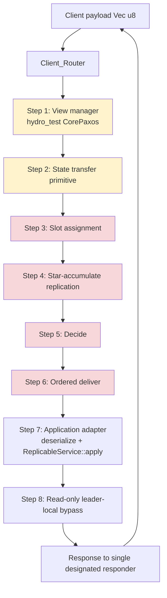
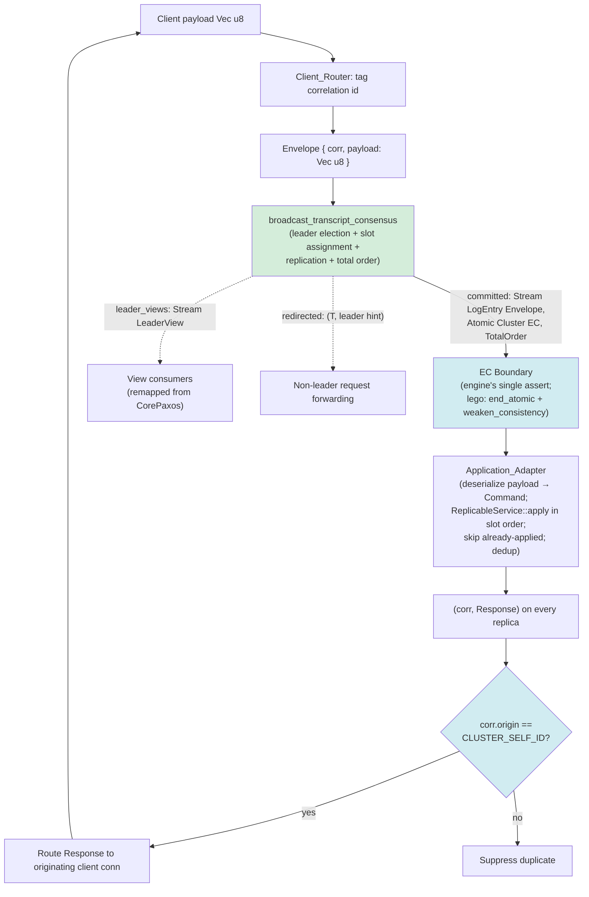

# Design Document: Lego_Replicate Transcript Backend (Option B)

## Overview

This design replaces `lego_replicate`'s hand-composed ordering-and-replication path — the middle of its 8-step `compose_protocol` pipeline (slot assignment, star-accumulate replication, decide, and ordered delivery) — with the in-tree `broadcast_transcript_consensus` engine used as a single ordering engine. The `ReplicableService` trait, the application adapter, and the client router remain on top of the new engine.

The engine already emits a committed **total order** of entries, does its own **leader election**, and carries a single EventualConsistency assertion at its committed-output boundary. Option B therefore is not a primitive-for-primitive swap; it is a *seam replacement*: lego stops producing order itself and instead feeds opaque client payloads into `broadcast_transcript_consensus`, then drives its existing application adapter from the engine's committed stream.

Three things make this integration non-trivial, and they are the crux of this document:

1. **The adapter seam** — how lego's opaque `Vec<u8>` client payloads become the engine's `requests: Stream<T,…>`, and how the engine's committed total order feeds lego's application adapter, with exactly one consistency assertion in the correct place.
2. **Response routing without a single-node bottleneck** — the `lego-replicate-v2` branch last reported `throughput=0` because the response path was never completed; the same "single designated responder" pattern still present in the in-tree `maelstrom::lin_kv` server (only the first member emits responses) serializes all replies through one node. Option B introduces a correlation-id scheme so the *originating* replica returns each response, distributing responder load.
3. **Reconciling redundant machinery** — lego's `CorePaxos` view manager and its state-transfer primitive both duplicate work the engine now owns (leader election and catch-up), and must be removed rather than left to disagree.

Two prerequisites frame the work. First, the branch does not compile against in-tree `hydro_lang` because `sim_input` changed from one generic parameter to three (`T, O: Ordering, R: Retries`), and the engine's own signature has drifted (it now requires a `net: impl Fn() -> Net` fault-model closure and a `nondet: NonDet` argument, plus a `NetworkFor<…, ConsistencyGuarantee = EventualConsistency>` bound). Second, the response path must be completed for throughput to exceed zero.

This document describes design only. It contains illustrative signatures and pseudocode, not implementation.

### Research Notes and Key Findings

The following were confirmed by reading the in-tree source and inform every decision below:

- **Engine signature (source of truth).** `hydro_test/src/cluster/broadcast_transcript_consensus.rs`:
  ```rust
  pub fn broadcast_transcript_consensus<'a, T, ClusterTag, Net>(
      cluster: &Cluster<'a, ClusterTag>,
      requests: Stream<T, Cluster<'a, ClusterTag>, Unbounded, impl Ordering>,
      election_timer_interrupts: Stream<(), Cluster<'a, ClusterTag>>,
      config: BroadcastConsensusConfig,        // { cluster_size: usize }
      net: impl Fn() -> Net,
      nondet: NonDet,
  ) -> BroadcastConsensusOutputs<'a, T, ClusterTag>
  where
      T: Clone + Eq + Serialize + DeserializeOwned + 'a,
      Net: NetworkFor<TranscriptMsg<T, ClusterTag>, ConsistencyGuarantee = EventualConsistency>,
      NoOrder: MinOrder<Net::OrderingGuarantee, Min = NoOrder>;
  ```
  Note the differences from the older `raft_server`-style signature in the engine's own design doc: `net` and `nondet` are now required, and `T` must be `Eq` (not `Hash`).

- **The single consistency assertion already lives inside the engine.** The committed output is raised from `NoConsistency` to `EventualConsistency` by exactly one `assert_has_consistency_of::<Cluster<'a, ClusterTag, EventualConsistency>>(manual_proof!(…))` immediately before it is returned, then `.atomic()`. The returned type is `Stream<LogEntry<T>, Atomic<Cluster<'a, ClusterTag, EventualConsistency>>, Unbounded, TotalOrder>`. This is decisive for Requirement 5 (see the EC Boundary section).

- **The existing consumers weaken, they do not re-assert.** Both `maelstrom::lin_kv::lin_kv_server` and `cluster::consensus_bench` consume `outputs.committed` via `.end_atomic().weaken_consistency()` and add **no** further `assert_has_consistency_of`. This is the pattern lego must copy.

- **The existing response path is the bottleneck to fix.** `lin_kv_server` tags requests as `KvOp { client_id, request }` (client_id is already a de-facto correlation id) but then applies committed entries on every replica while emitting responses **only** from `is_first_member`. That single-responder choice is exactly what produces the serialized-reply / low-throughput behavior lego must avoid.

- **`sim_input` now takes three generic parameters:** `fn sim_input<T, O: Ordering, R: Retries>()` (`hydro_lang/src/location/mod.rs`). Every lego call site currently passing one must pass three.

- **`net` policy constraint.** The `ConsistencyGuarantee = EventualConsistency` bound is compiler-enforced: `TCP.fail_stop().bincode()` and `TCP.lossy_delayed_forever().bincode()` satisfy it; plain `TCP.lossy()` sets `ConsistencyGuarantee = NoConsistency` and is correctly rejected. Simulation/functional tests use `fail_stop`; deployments facing real partitions (Maelstrom partition nemesis) use `lossy_delayed_forever`.

## Architecture

### Before: Legacy 8-step `compose_protocol`



Red = the ordering path replaced in Option B. Yellow = machinery reconciled/removed (view manager, state transfer).

### After: Option B, engine-backed



Green = the engine now owns ordering, replication, and leader election. Blue = the two design cruxes: the single EC boundary and the correlation-id-driven responder selection.

### Layering

The integration keeps lego's public surface intact and re-plumbs only the interior:

| Layer | Legacy_Path | Option B |
|-------|-------------|----------|
| `ReplicableService` trait | user-implemented, unchanged | user-implemented, unchanged |
| Client_Router | routes to slot-assignment; single responder | tags correlation id; originating-replica responder |
| Ordering / replication | steps 3–6, hand-composed | `broadcast_transcript_consensus` |
| Leader election / view | `CorePaxos` view manager (step 1) | engine's own election; `leader_views` |
| State transfer | dedicated primitive (step 2) | removed; committed-order replay |
| Application adapter | step 7 | unchanged logic, driven by engine's committed stream |
| Read-only path | step 8 leader-local bypass | committed-order-routed reads (default) |

## Components and Interfaces

### C1. The Adapter Seam (Requirement 2)

The engine is generic over the sequenced payload type `T`. lego sequences **opaque bytes**, so the payload byte content must survive untouched through the engine. Two shapes are possible for `T`:

- **`T = Vec<u8>`** — minimal, but leaves no room to carry a correlation id, forcing correlation to be recovered out-of-band. Rejected (see C3).
- **`T = RequestEnvelope`** — a small struct that wraps the opaque payload plus a correlation id. **Chosen.**

```rust
/// What lego feeds into `broadcast_transcript_consensus` as its generic `T`.
/// The engine sequences these opaquely; only the payload's *bytes* are lego's
/// command, and lego never asks the engine to interpret them.
#[derive(Clone, PartialEq, Eq, Serialize, Deserialize)]
pub struct RequestEnvelope {
    /// Correlation identifier (see C3). Globally unique per client request.
    pub corr: CorrelationId,
    /// The opaque command payload — `ReplicableService::Command` serialized by
    /// the client router. The engine never deserializes this.
    pub payload: Vec<u8>,
}
```

`RequestEnvelope` satisfies the engine's `T: Clone + Eq + Serialize + DeserializeOwned` bound. `Eq` is derived structurally; the engine uses it only for its internal fold bookkeeping, never to interpret `payload`. The payload bytes are preserved verbatim (Req 2.2): the engine copies `T` values, and `Vec<u8>` round-trips through `bincode` unchanged.

**Wiring in (client → engine).** The client router deserializes nothing; it wraps:

```rust
// requests: Stream<RequestEnvelope, Cluster<'a, Replica>, Unbounded, impl Ordering>
let requests = incoming_client_payloads          // Stream<(ClientConn, Vec<u8>), …>
    .map(q!(|(conn, payload)| RequestEnvelope {
        corr: CorrelationId::new(CLUSTER_SELF_ID.clone(), conn, /* local monotonic seq */),
        payload,
    }));
```

**Wiring out (engine → application adapter).** The engine returns `committed: Stream<LogEntry<RequestEnvelope>, Atomic<Cluster<Replica, EC>>, Unbounded, TotalOrder>`. lego consumes it exactly as the in-tree consumers do — `end_atomic().weaken_consistency()` — inside a `sliced!` block, sorts each tick's batch by `LogEntry.slot`, and applies in slot order (Req 2.3, 3.1, 3.2):

```rust
sliced! {
    let committed_batch = use::batch(
        engine_out.committed.end_atomic().weaken_consistency(),
        nondet!(/** batching does not change apply order; batch is sorted by slot */),
    );
    let mut svc = use::state(|l| l.singleton(q!(ReplicableService::new_empty())));
    let mut applied_through = use::state(|l| l.singleton(q!(0usize))); // next slot to apply
    // fold batch into a Vec, sort by slot, apply each not-yet-applied slot exactly once,
    // emit (corr, Response) per applied entry.
}
```

`LogEntry<T>` is `{ message: T, ballot: Ballot, slot: Slot }`; `slot` is the sequence position lego pairs with each payload (Req 2.3). The engine's gap-filling guarantees the committed stream is contiguous and monotonic with no gaps or duplicates (Req 2.4), so lego's adapter can rely on "apply from `applied_through`, skip nothing."

### C2. The EC Boundary (Requirement 5)

**Design decision: the single `assert_has_consistency_of` is the one already inside the engine; the lego integration adds none.**

The engine raises its committed output to `EventualConsistency` internally via exactly one `assert_has_consistency_of` carrying the Paxos safety invariant. Its returned `committed` stream is already `Atomic<Cluster<…, EventualConsistency>>`. The "EC_Boundary" defined in Requirement 5.1 — "the single point at which the EventualConsistency-typed committed output of the Consensus_Engine is first consumed by the ordering-engine integration" — is therefore the point where lego first touches `engine_out.committed`.

At that point lego performs only **consistency-preserving** operations to move the stream into the adapter's `sliced!` block:

- `.end_atomic()` — leaves the atomic scope; does not change the consistency parameter.
- `.weaken_consistency()` — moves EC → the adapter's local consumption; this is a *weakening*, not an `assert_has_consistency_of`, and is exactly what `lin_kv_server` and `consensus_bench` do.

Consequently:

- **Req 5.1 / 5.3:** There is exactly one `assert_has_consistency_of` in the whole engine-backed ordering integration, and it asserts `EventualConsistency`, matching paxos_ec/raft placement. lego reuses it rather than adding a second.
- **Req 5.2:** Between the engine's production of `committed` and this boundary, no operation changes the consistency parameter and no `manual_proof!` on consistency is applied to that output. `weaken_consistency` is the only transform and it does not strengthen or forge consistency.
- **Req 5.4:** A static check (grep in the module + a compile-time test, see Testing Strategy) enforces "no `assert_has_consistency_of` in the lego integration module," which — combined with the engine's single assertion — yields exactly one in total. Zero or two → non-conforming.

> Interpretation note recorded for reviewers: Requirement 5 is worded as if the integration itself performs the assertion. Because the engine is a reused component that self-asserts at its output boundary, the design satisfies the *intent* (exactly one EC assertion, correctly placed) by inheriting the engine's assertion and forbidding any new one in lego. If a future refactor makes the engine emit `NoConsistency` committed output, the single assertion would move into lego at this same boundary; the "exactly one, here" rule is unchanged either way.

### C3. Correlation-ID Response Routing (Requirement 4)

**Design decision: carry a `CorrelationId` through the engine inside `RequestEnvelope`; the originating replica — not a single designated node — emits each response.**

```rust
/// Globally-unique identifier for a client request, minted by the replica that
/// first receives it and preserved through the committed order so any replica
/// can decide whether *it* is the one that must answer.
#[derive(Clone, Copy, PartialEq, Eq, Hash, Serialize, Deserialize)]
pub struct CorrelationId {
    /// The replica that received the request from the client (the responder).
    pub origin: TaglessMemberId,
    /// Identifier of the client connection at that replica (bench_client
    /// virtual id, or Maelstrom client node id).
    pub client: ClientConnId,
    /// Per-origin monotonic counter, making (origin, client, seq) unique.
    pub seq: u64,
}
```

**Why this removes the bottleneck.** Every replica applies the identical committed order deterministically (C1), so every replica computes the identical `(corr, Response)` for every committed command. The only question is *who sends the reply*. The in-tree `lin_kv_server` answers "always the first member," serializing all replies through one node (`throughput=0` class). Option B answers "the replica named in `corr.origin`":

```rust
// inside the adapter's flat_map, after computing `resp` for an applied entry:
if entry.message.corr.origin == CLUSTER_SELF_ID.tagless() {
    out.push((entry.message.corr, resp));   // this replica owns the client conn
}
// else: another replica will emit it; suppress to avoid duplicate replies.
```

Because each replica emits only the responses for requests it originated, and clients are balanced across replicas, no node emits more than `ceil(100/N)%` of responses under balanced load (Req 4.2), and aggregate throughput scales with `N` (Req 4.3 — strictly > 0, replacing the prior `throughput=0`).

**Interaction with the engine's leader (only leader assigns slots).** Slot assignment and response emission are decoupled:

- **Request path.** A client hits some replica `r` (its origin). `r` mints `corr` and submits the `RequestEnvelope` into the engine. Internally the engine routes proposing to the current leader (only the leader assigns slots); non-leader submissions surface on the engine's `redirected` stream with a leader hint, which lego forwards to the leader. `corr.origin` is untouched by any of this.
- **Commit path.** The leader assigns a slot; the entry commits on **all** replicas in total order.
- **Response path.** Every replica applies it; only `corr.origin` emits. The origin need not be the leader — this is what breaks the leader-as-sole-responder coupling.

**Interaction with the deployed client transport.**

- **`bench_client`:** clients form their own cluster; each client's requests reach a replica that becomes `origin`. `consensus_bench` currently routes all requests to member 0 and responds from member 0; Option B's router instead lets each client's serving replica be the origin/responder, and the bench's `compute_throughput_latency` aggregator receives replies from all replicas. (The bench's fixed "leader = member 0" pinning for *slot assignment* is orthogonal and may be retained for measurement stability.)
- **Maelstrom bidi clients:** Maelstrom routes a reply by the `dest`/`in_reply_to` in the message body, and a node replies on *its own* stdout. Since each Maelstrom node has its own client connections, `corr.origin` = the node that read the request from stdin, and that node emits the reply. This is a strict generalization of the current `is_first_member` gate.

**Error/edge handling.**

- **Unmatched correlation (Req 4.5):** if a committed `Response` carries a `corr` whose `origin` is this replica but `(client, seq)` matches no pending local request (e.g., a duplicate delivered after the pending entry was already answered and cleaned up), the router discards it and records an "unmatched correlation" error indication with the offending `corr`.
- **Dead client connection (Req 4.6):** if `corr.origin == self` but the client connection is gone, the router drops the response, records an error, and continues (non-blocking) — it never stalls the per-tick emission loop.
- **Retained single-responder configs (Req 4.7):** a config flag `responder = SingleDesignated` may pin responses to one node (the legacy behavior) for debugging; its throughput impact must be documented as O(1) responder becoming the bottleneck.

### C4. Read-Only Command Handling (Requirement 6)

**Design decision: route read-only commands through the committed order by default (Req 6.4); expose leader-local reads only as a documented, non-default opt-in (Req 6.2/6.3) because the engine's leader role is not lease-protected.**

Rationale. The engine's leadership signals — `MessageGenState.is_leader`, `leader_activity_seen`, and the `leader_views` stream — are sufficient to *suppress dueling elections* but do **not** constitute a read lease. Ballot fencing guarantees commit *safety* even when two members transiently believe they lead, but a leader-local read served by a deposed-yet-unaware leader could miss a write already committed under the new leader — a linearizability violation, which Requirement 9 forbids. Therefore:

- **Default (active) strategy — Committed_Order-routed reads (Req 6.4):** a `Read_Only_Command` is wrapped in a `RequestEnvelope` like any write and sequenced. When it commits at slot `s`, the adapter evaluates it against the service state after applying slots `0..s` and returns the result. This makes each read reflect exactly the writes ordered before it (Req 6.1, 6.4) and is trivially linearizable. Reads consume a slot (a cost documented in the benchmark caveats, Req 10.5).
- **Opt-in strategy — leader-local reads (Req 6.2):** guarded by `is_leader`. `WHILE` a replica holds a valid leader role it may serve reads from local state without appending to the order. A non-leader that receives a read under this mode returns an error indication "cannot serve read consistently" and does **not** evaluate locally and does **not** modify the order (Req 6.3). Because the engine provides no lease, this mode is documented as offering only *sequential*/leader-monotonic reads, not linearizable reads, and is off by default.
- **Documentation (Req 6.5):** the published docs state which strategy is active (Committed_Order-routed by default) and the consistency each provides (linearizable vs. sequential).

`ReplicableService::is_read_only(&Command)` selects the path. Note the adapter must deserialize enough to call `is_read_only`; this happens on the origin replica *before* submission for the leader-local path, and on every replica *after* commit for the routed path.

### C5. View Manager and State Transfer Fate (Requirement 7)

**Design decision: remove lego's `CorePaxos` view manager (step 1) and remove the dedicated state-transfer primitive (step 2). Leadership comes solely from the engine; catch-up comes solely from committed-order replay.**

Justification. `broadcast_transcript_consensus` performs its own leader election (Prepare/Promise ballots driven by `election_timer_interrupts`, with leader-activity gating). Running lego's `CorePaxos` view manager alongside it creates two leadership authorities that can disagree — precisely what Req 7.3 warns against. Keeping both would also mean feeding two election-timer sources and reconciling two ballot spaces. Removal is cleaner than suppression.

Consequences and remapping:

- **Leadership identity (Req 7.1, 7.3):** derived exclusively from the engine. The `leader_views: Stream<LeaderView { ballot, leader }>` output is the single source of truth. Any resolution question resolves in favor of the engine — trivially, because the `CorePaxos` authority no longer exists.
- **`current_view` / `View` consumers (Req 7.2):** lego's `messages.rs` `View` type and any `Singleton<View,…>` consumers are re-backed by a projection of `leader_views` (map `LeaderView → View`). Because the `CorePaxos` manager is removed, it produces no output consumed by any downstream component (Req 7.2 is satisfied by construction). If some consumers need a `Singleton` "current view," derive it by `last()`/hold over `leader_views`.
- **State-transfer primitive (Req 7.4, 7.6):** **removed.** A recovering or lagging replica reconstructs its state by replaying the engine's committed order: it applies the committed prefix for the slots it has received, so its applied prefix equals the committed prefix (Req 7.4). Recovery of *missing* slots relies on the engine's Paxos Phase-1 re-`Accept` under a new leader (the documented engine limitation: a lagging member catches up when a new leader re-proposes committed slots, not via a stable-leader push — engine spec task 15.4). lego inherits this behavior and documents it.
- **Recovery failure (Req 7.5):** if replay fails at some slot (e.g., deserialization error mid-prefix), the adapter leaves the service state at the last cleanly-applied slot (no partial prefix) and surfaces a recovery-failure indication naming the slot — the same halt-and-report discipline as Req 3.4.
- **Documented decision (Req 7.6):** exactly one decision for the state-transfer primitive — **removed** — with the rationale above.

### C6. Compile Prerequisite Sequencing (Requirement 1)

**Design decision: make the Legacy_Path compile and go green *before* touching the ordering path. This is build step 0.**

Ordered API-drift remediation:

1. **`sim_input` 1 → 3 generic params (Req 1.2).** Every call site `x.sim_input::<T>()` becomes `x.sim_input::<T, O, R>()`. Pick `O`/`R` from how the stream is used: client-input ports that were implicitly total/exactly-once become `sim_input::<T, TotalOrder, ExactlyOnce>()`; ports feeding order-insensitive merges become `sim_input::<T, NoOrder, AtLeastOnce>()`. The compiler's downstream ordering/retry bounds pin the correct choice at each site.
2. **Engine call-site drift (only relevant once the swap begins, but noted here).** The engine now requires `net: impl Fn() -> Net` and `nondet: NonDet`, and `T: Eq`. Legacy_Path does not call the engine, so step 0 is unaffected; these land in the swap step.
3. **Baseline gating (Req 1.3, 1.4, 1.5).** After step 0, run every existing failover e2e test on the Legacy_Path against in-tree `hydro_lang`; each must terminate with a definitive pass/fail and the suite must be green. The Legacy_Path stays executable and passing until the engine-backed path passes its equivalent failover e2e tests (Req 1.5) — i.e., the swap is gated behind a green new-path suite, and the two paths coexist (behind a feature/config selector) during the transition.

## Data Models

### Types introduced by the integration

| Type | Definition | Purpose |
|------|-----------|---------|
| `RequestEnvelope` | `{ corr: CorrelationId, payload: Vec<u8> }` | The engine's generic `T`; opaque payload + correlation id (C1, C3) |
| `CorrelationId` | `{ origin: TaglessMemberId, client: ClientConnId, seq: u64 }` | Globally-unique request id; names the responder (C3) |
| `ClientConnId` | transport-specific (bench virtual id / Maelstrom node id string) | Identifies a client connection at its origin replica |
| `ResponseEnvelope` | `{ corr: CorrelationId, response: Vec<u8> }` | Serialized `ReplicableService::Response` tagged for routing |

### Types reused from the engine

| Type | Definition | Role in lego |
|------|-----------|--------------|
| `LogEntry<T>` | `{ message: T, ballot: Ballot, slot: Slot }` | Committed unit; `slot` is lego's sequence position (Req 2.3) |
| `BroadcastConsensusOutputs<'a, T, CT>` | `{ committed, redirected, leader_views }` | Engine outputs consumed by lego |
| `LeaderView<CT>` | `{ ballot: Ballot, leader: Option<MemberId<CT>> }` | Re-backs lego's `View` (C5) |
| `BroadcastConsensusConfig` | `{ cluster_size: usize }` | Engine config; quorum = `cluster_size/2 + 1` |

### Adapter application state (per replica)

| Field | Type | Invariant |
|-------|------|-----------|
| `svc` | `ReplicableService` | reflects exactly the applied committed prefix |
| `applied_through` | `Slot` | next slot to apply; equals count of applied entries; no gaps |
| `pending` | `Map<CorrelationId, ClientConn>` | requests this replica originated and has not yet answered |

### Sequence-position contract (Req 2.4)

The engine's committed stream is `TotalOrder` and gap-filled: slots are `0,1,2,…` contiguous, unique, monotonically increasing. lego's adapter asserts this contract by construction — it only ever advances `applied_through` by exactly one per applied slot and refuses to apply a slot `!= applied_through` — turning any engine contract violation into a detected error rather than silent divergence.

### Data-flow (request lifecycle)

```mermaid
sequenceDiagram
    participant Cl as Client
    participant R as Origin Replica r (corr.origin)
    participant L as Leader Replica
    participant All as All Replicas (incl. r)

    Cl->>R: payload (Vec u8)
    Note over R: mint corr = (r, conn, seq)<br/>wrap RequestEnvelope
    R->>L: submit (engine routes proposing to leader)
    Note over L: assign slot s (leader-only)
    L-->>All: Accept(slot=s, RequestEnvelope) → quorum → commit
    Note over All: apply in slot order;<br/>compute (corr, Response) deterministically
    All-->>R: (only r: corr.origin == self)
    R->>Cl: Response (routed by corr.client)
    Note over All: non-origin replicas suppress reply
```

## Correctness Properties

*A property is a characteristic or behavior that should hold true across all valid executions of a system — essentially, a formal statement about what the system should do. Properties serve as the bridge between human-readable specifications and machine-verifiable correctness guarantees.*

PBT applies to this integration because its core is pure logic over structured inputs: the application adapter (a deterministic fold of a committed log into service state), the correlation-id routing function, the sequence-position contract, and the read-evaluation rule. These have meaningful "for all committed sequences / all request sets" statements and benefit from 100+ randomized iterations, including adversarial delivery schedules. Infrastructure-flavored criteria (throughput, election timing, Maelstrom linearizability runs, benchmark methodology, the compile/baseline prerequisite, the single-assertion static check, documentation) are covered by integration, smoke, and static checks in the Testing Strategy instead.

The properties below are the reflected, de-duplicated set derived from the prework analysis.

### Property 1: Opaque payload round-trip preservation

*For any* client payload (arbitrary `Vec<u8>`, including empty and large), wrapping it in a `RequestEnvelope`, sequencing it through the engine, and recovering it at the application adapter SHALL yield byte-for-byte the original payload, with no deserialization performed by the engine.

**Validates: Requirements 2.2**

### Property 2: Sequence-position contract

*For any* committed log produced by the engine and consumed by the adapter, the sequence positions delivered SHALL be unique, contiguous, and monotonically increasing (0, 1, 2, …) with no gaps and no duplicates, and each payload SHALL be delivered to the adapter paired with its own assigned position in ascending position order.

**Validates: Requirements 2.3, 2.4**

### Property 3: Deterministic ordered application (exactly once)

*For any* committed sequence and any already-applied prefix, the application adapter SHALL invoke `apply` exactly once per not-yet-applied position, in strictly ascending position order beginning at the first not-yet-applied position and skipping none, and SHALL expose a `Response` only for a fully-applied committed entry (never a partially-applied one).

**Validates: Requirements 3.1, 3.2, 9.3**

### Property 4: Idempotent duplicate delivery

*For any* committed sequence in which arbitrary positions are delivered more than once, the application adapter SHALL invoke `apply` at most once for each position (each position's apply-call multiplicity is exactly one).

**Validates: Requirements 3.5**

### Property 5: Deterministic replica convergence

*For any* command sequence, two replicas that have each applied the identical committed prefix (positions 0 through N) — whether applied live or reconstructed by replaying the committed order on rejoin — SHALL produce byte-for-byte equal results from `snapshot`.

**Validates: Requirements 3.3, 7.4**

### Property 6: Prefix-consistency / no-fork

*For any* delivery schedule (arbitrary reorderings, concurrent elections, crashes, partial deliveries), the committed logs of any two replicas SHALL be prefix-consistent — one is a prefix of the other and they hold identical values at every shared position — the count of divergent (forked) positions SHALL be zero, and no previously committed value SHALL be rolled back or replaced by a divergent value at the same position (any such conflicting operation is rejected and the prior value preserved).

**Validates: Requirements 8.3, 9.2, 9.4**

### Property 7: Response-correlation correctness

*For any* set of client requests each carrying a unique correlation id, the committed `Response` for each request SHALL carry that same correlation id, and the router SHALL emit each `Response` from exactly the replica named by `corr.origin` (all other replicas suppress it), routed to exactly the one originating client identified by the correlation id — yielding a bijection between requests and delivered responses and, under balanced origin distribution across `N` replicas, no replica emitting more than `ceil(100/N)%` of responses.

**Validates: Requirements 4.1, 4.2, 4.4**

### Property 8: Read-reflects-prefix (read-your-writes)

*For any* sequence of writes and a read-only command evaluated at committed position S under the active (Committed_Order-routed) strategy, the read's `Response` SHALL reflect the effects of exactly the writes ordered before S in the Committed_Order and no writes ordered at or after S.

**Validates: Requirements 6.1, 6.4**

## Error Handling

### Deserialization failure at a committed position (Req 3.4)

When the adapter cannot deserialize a committed `Opaque_Payload` into a `Command`, it halts application at that position, leaves the `ReplicableService` state exactly as it was immediately before that position (no partial or corrupted command applied — `apply` is never called for a payload that failed to deserialize), and surfaces an error identifying the failing position and the deserialization cause. `applied_through` is not advanced past the failing slot.

### Recovery/replay failure (Req 7.5)

Recovery is committed-order replay (state transfer removed, C5). If replay fails at some position, the replica's state is left at the last cleanly-applied position (no partial prefix), and a recovery-failure indication naming that position is surfaced — the same halt-and-report discipline as deserialization failure.

### Unmatched correlation id (Req 4.5)

If a committed `Response` reaches `corr.origin == self` but no pending local request matches `(client, seq)` (e.g., a duplicate delivered after the pending entry was answered and cleaned up), the router discards the response without routing it and records an "unmatched correlation" error indication carrying the offending `corr`.

### Dead client connection (Req 4.6)

If `corr.origin == self` but the client connection is no longer available, the router drops that response, records an error indication, and continues routing other responses without blocking the per-tick emission loop.

### Network faults and leader failover

- **`net` policy:** `fail_stop` (simulation/functional) delivers a prefix or nothing — no corruption; `lossy_delayed_forever` (partition-facing deployments) delays but never permanently drops, preserving the EC transcript's eventual-delivery guarantee. Plain `lossy` is rejected at compile time by the `ConsistencyGuarantee = EventualConsistency` bound.
- **Leader crash:** ballot fencing + quorum intersection preserve commit safety (no fork) regardless of election contention; the fault model affects only liveness/latency. Recovery of missing slots on a lagging replica occurs when a new leader re-`Accept`s committed slots (documented engine limitation: no stable-leader push, engine spec task 15.4).

### Consistency-boundary misuse (Req 5.4)

If the integration ends up with any `assert_has_consistency_of` in the lego module (making the total count ≠ 1), verification fails and names the offending assertion; if the engine's sole assertion were removed (count 0), verification fails naming the missing assertion.

## Testing Strategy

### Dual approach

- **Property tests** verify the universal logic properties above across randomized inputs (including adversarial delivery/crash schedules).
- **Unit / example / edge tests** verify concrete scenarios, error conditions, and the opt-in leader-local read path.
- **Integration tests** verify liveness, failover, linearizability, throughput, and the compile/baseline prerequisite against real/simulated systems.
- **Static / smoke checks** verify the single-assertion rule, the removal of the view manager, and documentation presence.

### Property-based tests

- **Library:** `proptest` (the Rust ecosystem standard already used by the engine's own property suite in `hydro_test/tests/broadcast_transcript_consensus_props.rs`). Do not hand-roll PBT.
- **Iterations:** minimum 100 per property (engine suite uses `proptest.cases = 256`; match it).
- **Tag format** on each property test:
  ```
  // Feature: lego-replicate-transcript-backend, Property N: <property text>
  ```
- **Mapping (one property-based test per property):**
  - P1 payload round-trip — random `Vec<u8>` (empty, large, non-UTF8), assert bytes preserved through envelope/commit.
  - P2 sequence-position contract — random committed logs, assert contiguous/monotonic/ascending pairing; adapter rejects any slot ≠ `applied_through`.
  - P3 deterministic ordered application — random sequences + random already-applied prefix, mock `ReplicableService` recording apply calls; assert exactly-once ascending and no partial-response exposure.
  - P4 idempotent duplicate delivery — sequences with random duplicated slots; assert per-slot apply multiplicity == 1.
  - P5 replica convergence — random command sequence applied on two replicas (one live, one via replay); assert equal `snapshot` after each prefix. Use an observationally-deterministic mock service.
  - P6 prefix-consistency / no-fork — adversarial delivery + crash schedules across replicas; assert pairwise prefix relation, zero forked slots, and rejection of divergent-value overwrites. Reuses the engine's `StepBroadcastCluster` adversarial harness pattern.
  - P7 response-correlation — random requests with unique corr across N origins; assert request↔response bijection by corr, responder == `corr.origin`, others suppress, and ≤ `ceil(100/N)%` per-node share under balanced origins.
  - P8 read-reflects-prefix — random write sequences with a read inserted at a random committed position; assert the read reflects exactly the prior writes.

### Unit / example / edge tests

- Deserialization failure at a random slot halts, preserves prior snapshot, errors with slot + cause (Req 3.4).
- Unmatched correlation discarded with error (Req 4.5); dead client connection dropped, error recorded, subsequent responses still routed (Req 4.6).
- Leader-local read served locally with unchanged order while leader (Req 6.2); non-leader read under leader-local mode errors, no local response, order unchanged (Req 6.3).
- `View` derived solely from `leader_views`; no `CorePaxos` view output wired (Req 7.1, 7.2).
- Recovery failure leaves state unchanged and surfaces an indication (Req 7.5).
- Leader-activity gating suppresses a follower's competing election (Req 8.5).

### Integration tests

- **Maelstrom lin-kv harness (reuse):** extend the in-tree `hydro_test/src/maelstrom/lin_kv.rs` server — but replace its single-responder `is_first_member` gate with the `corr.origin` responder rule — and run it under the existing `run_repeated` pattern (3 independent randomized repetitions, partition/kill nemeses, `TCP.lossy_delayed_forever().bincode()`). Assert zero linearizability violations (Req 9.1), prefix-consistency (Req 9.2), no torn values under ≥60s load (Req 9.3).
- **lego failover e2e:** run every existing `lego_replicate` failover end-to-end test against the engine-backed path; zero failures (Req 8.1–8.4, 9.5). Keep the Legacy_Path suite green throughout the transition (Req 1.5).
- **Bench comparison:** use `hydro_std::bench_client` via the `consensus_bench` shape vs. the Legacy MultiPaxos (`paxos_bench` / `CorePaxos`) path with identical client count, workload, cluster size, warmup, and measurement windows; report throughput min/median/mean/max and the engine-to-legacy median ratio; state transport / cluster-size / read-strategy caveats; flag runs that miss steady state as invalid (Req 4.3, 10.1–10.6).

### Static / smoke checks

- **Prerequisite (Req 1):** compile lego against in-tree `hydro_lang` with the `sim_input<T, O, R>` migration applied (Req 1.1, 1.2); run the failover baseline (Req 1.3, 1.4).
- **Single EC assertion (Req 5):** static check that the lego integration module contains zero `assert_has_consistency_of`, so the engine's sole assertion is the only one (total == 1); flag and name any deviation (Req 5.1–5.4).
- **Documentation (Req 4.7, 6.5, 7.6):** presence checks for the responder-tradeoff note, the active read strategy + consistency level, and the state-transfer decision (removed) with rationale.

### Test configuration

```toml
[profile.test]
proptest.cases = 256
proptest.max_shrink_iters = 10000
```
