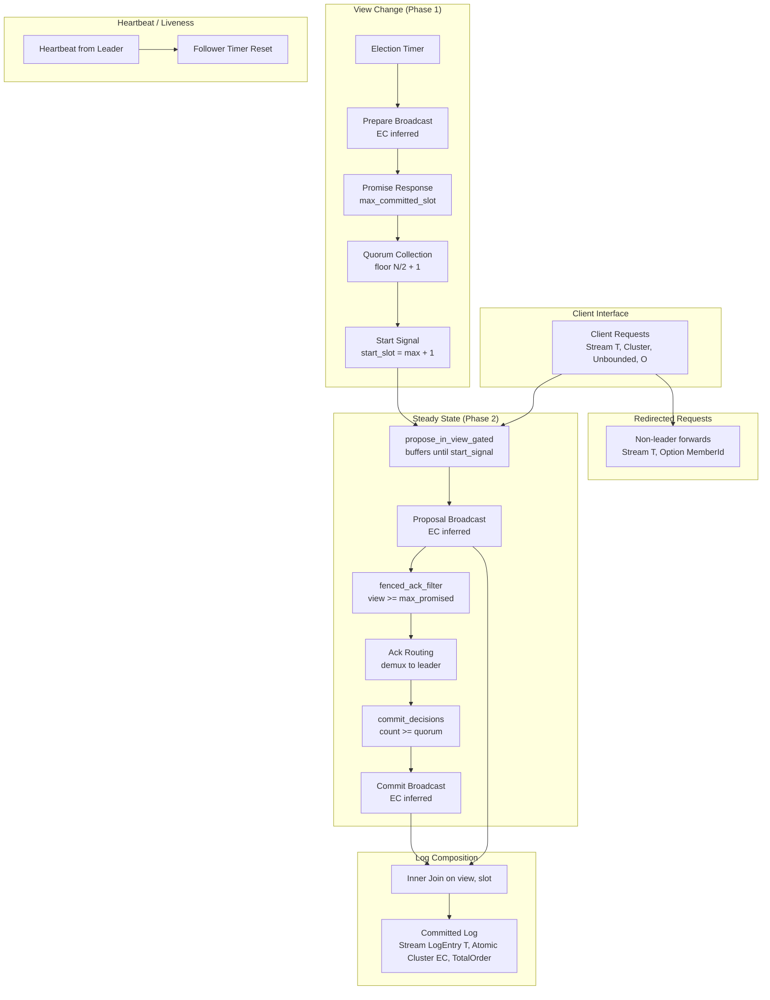

# Design Document: Typed Consensus

## Overview

Typed Consensus is a Paxos-structured consensus protocol for Hydro that achieves the same input/output contract as Raft but derives its `EventualConsistency` guarantee compositionally from type-level building blocks rather than a monolithic `manual_proof!`.

The protocol decomposes consensus into five independently-typed pieces:

1. **Per-view proposal broadcast** — leader sequences requests, broadcasts via `broadcast_from_member`. EC inferred.
2. **Per-view commit broadcast** — leader counts acks, broadcasts commit notifications via `broadcast_from_member`. EC inferred.
3. **Prepare/Promise (Phase 1)** — new leader broadcasts Prepare via `broadcast_from_member`. EC inferred. Members respond with Promise + max committed slot.
4. **Fenced ack filter** — driven by Prepare stream, members reject proposals from stale views.
5. **Committed log composition** — inner join of proposals ∩ commits on (view, slot), merged across views.

The EC of the committed log follows from: each per-view commit stream is EC (inferred), the join is deterministic, and cross-view safety (no slot conflicts) is guaranteed by quorum intersection with a single `manual_proof!`.

The protocol requires exactly **2 `manual_proof!` annotations**: one for quorum-intersection safety (ViewTransferProof), one for commutativity of ack counting.

### Design Rationale

The Raft implementation in `hydro_test/src/cluster/raft.rs` achieves EC via a single opaque `manual_proof!` on the entire committed log. This gives no compositional insight — the proof obligation is "the whole protocol is correct." Typed Consensus decomposes this into per-piece type inference (zero manual proofs) plus one small semantic claim (quorum intersection). The simulator validates the composition empirically.

## Architecture



### Dataflow Topology

The protocol is a single dataflow graph constructed by calling `typed_consensus(...)`. Internally it wires:

1. **Election/heartbeat timer streams** feed view-change logic.
2. **Prepare broadcast** (EC inferred) establishes fencing.
3. **Promise collection** accumulates across ticks until quorum is reached.
4. **Start signal** (from quorum) unblocks proposal gating.
5. **Proposal broadcast** (EC inferred) sequences client requests within `sliced!`.
6. **Fenced ack filter** suppresses acks for stale-view proposals.
7. **Ack counting + commit broadcast** (EC inferred) fires once quorum reached.
8. **Log join** — proposals ∩ commits keyed on (view, slot) — produces committed entries.

The key causal dependency: proposals for view V are causally downstream of the promise quorum for view V. This is enforced by `propose_in_view_gated` buffering requests until the start signal fires.

## Components and Interfaces

### Public API

```rust
/// The top-level entry point — drop-in replacement for raft().
pub fn typed_consensus<'a, T, ClusterTag, Con, O, Net>(
    requests: Stream<T, Cluster<'a, ClusterTag, Con>, Unbounded, O>,
    election_timer_interrupts: Stream<(), Cluster<'a, ClusterTag>>,
    heartbeat_timer_interrupts: Stream<(), Cluster<'a, ClusterTag>>,
    config: TypedConsensusConfig,
    net: impl Fn() -> Net,
    nondet_order: NonDet,
) -> (
    Stream<
        LogEntry<T>,
        Atomic<Cluster<'a, ClusterTag, EventualConsistency>>,
        Unbounded,
        TotalOrder,
    >,
    Stream<
        (T, Option<MemberId<ClusterTag>>),
        Cluster<'a, ClusterTag, NoConsistency>,
        Unbounded,
        TotalOrder,
    >,
)
where
    T: Clone + Serialize + DeserializeOwned + 'a,
    O: Ordering,
    Con: Consistency,
    ClusterTag: 'a,
    Net: NetworkFor<TypedConsensusRpc<T, ClusterTag>>,
    NoOrder: MinOrder<Net::OrderingGuarantee, Min = NoOrder>,
```

This matches Raft's signature exactly: same inputs (requests + timer streams + config + net factory + NonDet), same outputs (committed log + redirected requests). The only differences are the config struct type and the RPC enum type.

### Internal Components

| Component | Function | EC Source |
|-----------|----------|-----------|
| `propose_in_view_gated` | Sequences requests into (view, slot) proposals, gated by start_signal | `broadcast_from_member` — inferred |
| `phase1_prepare` | Broadcasts Prepare, collects Promises | `broadcast_from_member` — inferred |
| `fenced_ack_filter` | Rejects proposals from views < max_promised_view | Preserves EC of input (1 `manual_proof!` on filter monotonicity — but this is now folded into the quorum-intersection proof) |
| `commit_decisions` | Counts acks per (view, slot), broadcasts CommitNotification when quorum reached | `broadcast_from_member` — inferred |
| `compose_committed_log` | Joins proposals ∩ commits on (view, slot), merges across views | Deterministic join of EC streams — EC by construction |
| `view_change_logic` | Drives election timers, heartbeat resets, view number advancement | Internal state management |

### Wire Protocol (Intra-Cluster RPC)

```rust
pub enum TypedConsensusRpc<T, ClusterTag> {
    Prepare(PrepareMsg),
    Promise(PromiseMsg),
    Proposal(ProposalMsg<T>),
    ProposalAck(ProposalAckMsg),
    Commit(CommitMsg),
    Heartbeat(HeartbeatMsg<ClusterTag>),
}
```

All intra-cluster traffic flows over a single `NetworkFor<TypedConsensusRpc<T, ClusterTag>>` channel, demuxed by message type on receipt. This mirrors Raft's approach (single `RaftRpc` enum over one channel).

## Data Models

### Core Types

```rust
/// Configuration for the typed consensus protocol.
#[derive(Clone, Copy, Debug, PartialEq, Eq)]
pub struct TypedConsensusConfig {
    /// Total cluster size. Quorum = cluster_size / 2 + 1.
    pub cluster_size: usize,
}

/// A committed log entry — the protocol's primary output.
#[derive(Clone, Debug, PartialEq, Eq, Serialize, Deserialize)]
pub struct LogEntry<T> {
    /// The client payload.
    pub message: T,
    /// The view in which this entry was committed.
    pub view: usize,
    /// The slot index (0-based, contiguous across views).
    pub slot: usize,
}

/// A proposal: leader assigns (view, slot) to a client request.
#[derive(Clone, Debug, PartialEq, Eq, PartialOrd, Ord, Serialize, Deserialize)]
pub struct ProposalMsg<T> {
    pub view: usize,
    pub slot: usize,
    pub value: T,
}

/// Prepare message: candidate leader initiates a new view.
#[derive(Clone, Debug, PartialEq, Eq, Hash, Serialize, Deserialize)]
pub struct PrepareMsg {
    pub view: usize,
    pub from_leader: MemberId<ClusterTag>,
}

/// Promise response: member pledges to fence out lower views.
#[derive(Clone, Debug, PartialEq, Eq, Serialize, Deserialize)]
pub struct PromiseMsg {
    pub view: usize,
    pub max_committed_slot: usize,
    pub from_member: MemberId<ClusterTag>,
}

/// Acknowledgement that a member accepted a proposal.
#[derive(Clone, Debug, PartialEq, Eq, Serialize, Deserialize)]
pub struct ProposalAckMsg {
    pub view: usize,
    pub slot: usize,
    pub from_member: MemberId<ClusterTag>,
}

/// Commit notification: leader declares a slot committed.
#[derive(Clone, Debug, PartialEq, Eq, PartialOrd, Ord, Serialize, Deserialize)]
pub struct CommitMsg {
    pub view: usize,
    pub slot: usize,
}

/// Heartbeat from the leader to prevent election timer expiry.
#[derive(Clone, Debug, PartialEq, Eq, Serialize, Deserialize)]
pub struct HeartbeatMsg<ClusterTag> {
    pub view: usize,
    pub leader: MemberId<ClusterTag>,
}
```

### Per-Member State (inside `sliced!` blocks)

| State | Type | Purpose |
|-------|------|---------|
| `current_view` | `usize` | Current view number this member believes is active |
| `max_promised_view` | `usize` | Highest view promised — fences acks for lower views |
| `max_committed_slot` | `usize` | Highest slot committed locally — reported in Promises |
| `next_slot` | `usize` | Next slot to assign (leader only, within `propose_in_view_gated`) |
| `ack_counts` | `HashMap<usize, usize>` | Per-slot ack accumulator (leader only) |
| `already_committed` | `HashSet<usize>` | Slots already committed (leader only, prevents duplicate commits) |
| `election_timer_ticks` | `usize` | Ticks since last heartbeat (triggers view change on expiry) |

### Manual Proof Surface

| # | Location | Claim | Justification |
|---|----------|-------|---------------|
| 1 | `ViewTransferProof` / quorum collection | Quorum intersection: once f+1 members promise view V, at most f will ack view < V. Any committed entry was acked by f+1 members, so by pigeonhole at least one quorum respondent witnessed it. | Paxos Phase-1 safety argument |
| 2 | `commit_decisions` ack-count fold | Commutativity: counting acks for a slot is commutative (addition is commutative). | Trivial |


## Correctness Properties

*A property is a characteristic or behavior that should hold true across all valid executions of a system — essentially, a formal statement about what the system should do. Properties serve as the bridge between human-readable specifications and machine-verifiable correctness guarantees.*

### Property 1: Slot Assignment Uniqueness and Contiguity

*For any* sequence of client requests submitted to the leader within a view starting at `start_slot`, the resulting proposals SHALL have slot indices that are contiguous starting from `start_slot`, and no two proposals within the view share the same slot index.

**Validates: Requirements 2.2, 2.4**

### Property 2: Non-Leader Request Redirection

*For any* client request delivered to a cluster member that is not the current view's leader, the request SHALL appear on the redirected-requests output stream (paired with the current leader's identity if known) and SHALL NOT produce a proposal.

**Validates: Requirements 2.3**

### Property 3: Commit Threshold and At-Most-Once Semantics

*For any* (view, slot) pair, the protocol SHALL emit exactly one commit notification when the ack count for that pair reaches floor(N/2) + 1, and SHALL emit zero commit notifications if the ack count remains below that threshold, regardless of the order in which acks arrive.

**Validates: Requirements 3.1, 3.2**

### Property 4: Promise Production Correctness

*For any* cluster member with current max_promised_view = V receiving a Prepare for view W, a Promise SHALL be produced if and only if W > V, and the Promise SHALL contain the member's current max_committed_slot.

**Validates: Requirements 4.2, 4.3**

### Property 5: Fenced Ack Suppression

*For any* cluster member with max_promised_view = V, when that member receives a proposal from view W < V, the member SHALL NOT emit an acknowledgement for that proposal.

**Validates: Requirements 4.4**

### Property 6: Proposal Gating on Promise Quorum

*For any* view V, no proposal message for view V SHALL be broadcast to any replica before the leader of view V has collected floor(N/2) + 1 Promise responses for view V. Client requests arriving before the quorum is reached SHALL be buffered and only proposed after the start signal fires.

**Validates: Requirements 4.5, 5.3, 9.6, 11.1**

### Property 7: Start Slot Computation from Quorum Read

*For any* set of Promise responses from a quorum of members reporting max_committed_slot values, the new view's start slot SHALL equal max(all reported max_committed_slot values) + 1, yielding start slot 1 when all members report 0.

**Validates: Requirements 5.1, 5.2, 9.5**

### Property 8: Committed Log Composition Correctness

*For any* set of proposals and commit notifications, the committed log SHALL contain exactly those entries where a proposal and a commit notification share the same (view, slot) key, with the committed entry carrying the proposal's value.

**Validates: Requirements 6.1**

### Property 9: Safety — At Most One Value Per Slot

*For any* execution explored by the simulator (all possible message orderings, batch boundaries, and concurrent view scenarios), the protocol SHALL never produce two committed entries with the same slot index but different values, across any cluster member.

**Validates: Requirements 6.2, 8.2, 11.2, 11.3**

### Property 10: Eventual Consistency Convergence

*For any* execution where all messages are eventually delivered (no permanent network partition), all live cluster members SHALL eventually observe the same committed log — i.e., for every slot that is committed on any member, every other live member eventually commits the same value for that slot.

**Validates: Requirements 6.4, 6.5, 8.5**

### Property 11: Liveness Under Stable View

*For any* client request submitted while a single view is active, all cluster members are reachable, and no leader change occurs, the request SHALL be committed within 50 simulator ticks after submission.

**Validates: Requirements 8.3**

## Error Handling

### View Change Recovery

| Error Condition | Behavior |
|----------------|----------|
| Leader crashes mid-view | Election timer on followers expires → new view initiated. Quorum read recovers max committed slot. New leader starts sequencing at max + 1. |
| Prepare arrives for stale view (view <= max_promised) | Discarded without response. No state change. |
| Promise responses insufficient (< quorum) | Leader continues accumulating across ticks. No start signal emitted. Requests buffered indefinitely until quorum reached or a higher-view Prepare preempts. |
| Proposals from stale view arrive after fencing | Suppressed by `fenced_ack_filter`. Never acknowledged. Cannot reach quorum. |

### Concurrent View Conflicts

| Scenario | Resolution |
|----------|-----------|
| Two members initiate views simultaneously | Higher-numbered view wins (fencing ensures lower view can't reach ack quorum once f+1 promise the higher view). |
| Old leader's in-flight proposals arrive after prepare | Filtered by fenced_ack_filter on each member that has promised a higher view. At most f members (those that haven't yet seen the Prepare) can still ack — not enough for quorum. |
| Network partition during phase 1 | If candidate can reach quorum on its partition, it succeeds. If not, it stalls. Safety is never violated (quorum intersection). |

### Request Handling Errors

| Error Condition | Behavior |
|----------------|----------|
| Request arrives at non-leader | Forwarded to redirected-requests stream with `Some(leader_id)` if leader is known, `None` otherwise. |
| Request arrives while leader is collecting promises | Buffered in `propose_in_view_gated`. Proposed once start signal fires. |
| Request arrives after leader is preempted | Leader detects higher-view Prepare, stops proposing. Buffered requests are redirected when the new leader is known. |

### Invariant Violations (Detectable by Simulator)

- **Slot conflict**: Two committed entries with same slot, different values → safety violation. Simulator panics.
- **Causal violation**: Proposal broadcast before promise quorum → invalid causal ordering. Impossible by construction (propose_in_view_gated structurally prevents this).
- **Duplicate commit**: Multiple commit notifications for the same (view, slot) → bug in `already_committed` set maintenance.

## Testing Strategy

### Dual Testing Approach

The protocol uses both property-based testing (via the Hydro deterministic simulator) and example-based unit tests.

### Property-Based Testing via Hydro Simulator

The Hydro simulator IS the property-based testing engine. Each simulation test explores many execution schedules (batch boundaries, message orderings, timing) for the same logical scenario. This is equivalent to traditional PBT where the "random input" is the non-deterministic execution schedule.

**Library**: Hydro's built-in `flow.sim().exhaustive(...)` and `flow.sim().fuzz(...)`.

**Minimum iterations**: The simulator explores all reachable states for `exhaustive` mode. For `fuzz` mode, minimum 100 iterations (schedule variations).

**Each property test must reference its design document property:**

```rust
// Feature: typed-consensus, Property 9: Safety — at most one value per slot
#[test]
fn test_no_slot_conflicts_under_concurrent_views() { ... }
```

### Test Categories

#### Compile-Time Type Assertions (Properties validated at compile time)
- Return type is `Stream<LogEntry<T>, Atomic<Cluster<..., EventualConsistency>>, Unbounded, TotalOrder>`
- EC inferred on all broadcast streams (proposal, commit, prepare) without `manual_proof!`
- Signature compatibility with Raft's input/output types

#### Simulator Safety Tests (Property 9)
- **Concurrent views, 3-node cluster**: Two views overlap, fuzz all orderings. Assert no slot conflicts.
- **Concurrent views, 5-node cluster**: Same with larger cluster.
- **Rapid view changes**: 5+ views in quick succession. Assert no slot conflicts.
- **Cascading failures**: Leader fails, new leader fails immediately. Assert safety holds.

#### Simulator Liveness Tests (Property 11)
- **Stable view commits**: Submit N requests, assert all committed within 50 ticks.
- **Post-view-change commits**: After successful view change, submit requests, assert commit.

#### Simulator Property Tests (Properties 1-8, 10)
- **Slot uniqueness** (Property 1): Submit random request counts, verify contiguous unique slots.
- **Non-leader redirect** (Property 2): Send requests to non-leaders, verify redirected-requests output.
- **Commit threshold** (Property 3): Vary cluster size (3, 5, 7), verify commit exactly at quorum.
- **Promise logic** (Property 4): Inject Prepares at various views, verify Promise/discard behavior.
- **Ack suppression** (Property 5): After Prepare, inject stale-view proposals, verify no acks.
- **Gating** (Property 6): Verify no proposals before promise quorum via causal assertion.
- **Start slot** (Property 7): Vary max_committed values in quorum, verify start_slot computation.
- **Log composition** (Property 8): Run full protocol, verify committed log = proposals ∩ commits.
- **EC convergence** (Property 10): After all messages delivered, verify all members have identical logs.

#### Performance Benchmarks (Requirement 10)
- **Throughput comparison**: Benchmark harness running typed_consensus vs raft on same cluster, same workload, measuring requests/second.
- **Latency comparison**: Single-request p50 latency measurement over 100+ trials.
- **Deployment targets**: Local, GCP, AWS using Hydro deploy infrastructure.

### Test Configuration

```rust
// Example: Safety property test structure
#[test]
fn test_safety_no_slot_conflicts() {
    // Feature: typed-consensus, Property 9: Safety — at most one value per slot
    let mut flow = FlowBuilder::new();
    let cluster = flow.cluster::<Nodes>();

    let (req_port, requests) = cluster.sim_input::<u32, TotalOrder, ExactlyOnce>();
    let (timer_port, election_timers) = cluster.sim_input::<(), TotalOrder, ExactlyOnce>();
    let (hb_port, heartbeat_timers) = cluster.sim_input::<(), TotalOrder, ExactlyOnce>();

    let (committed, _redirected) = typed_consensus(
        requests,
        election_timers,
        heartbeat_timers,
        TypedConsensusConfig { cluster_size: 3 },
        || TCP.fail_stop().bincode(),
        nondet!(/** test */),
    );

    let output = committed.sim_cluster_output();

    flow.sim()
        .with_cluster_size(&cluster, 3)
        .fuzz(async || {
            // Trigger view change mid-flight
            req_port.send(0, 100);  // request to initial leader
            timer_port.send(1, ()); // member 1 triggers election

            // Collect commits from all members
            // Assert: for each slot, all members agree on the value
            let c0 = output.collect_n_sorted(0, 1).await;
            let c1 = output.collect_n_sorted(1, 1).await;
            let c2 = output.collect_n_sorted(2, 1).await;

            // Safety: same slot → same value across all members
            // (The simulator explores all orderings)
        });
}
```

### manual_proof! Audit Strategy

A dedicated test counts `manual_proof!` occurrences in the module source:
- Exactly 2 total
- One at `ViewTransferProof` (quorum intersection)
- One at `commit_decisions` fold (commutativity)
- Each contains a 1-3 sentence doc comment

This can be a `#[test]` that reads the source file and grep-counts, or a CI check.
