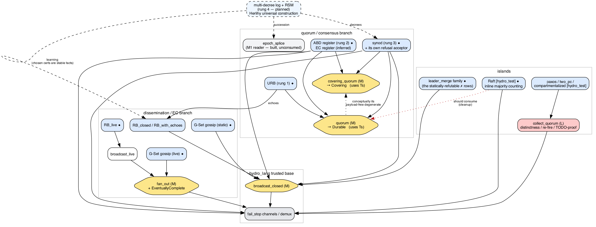

# Quorum Certificates: the Monotone Half of Consensus

2026-08. Companion code: `hydro_std/src/ec_inference_demos/quorum.rs` (rung 0),
`uniform_broadcast.rs` (rung 1).

## 1. The boundary this program respects: types vs. proof

EC inference works because EC is a type-shaped property: value-abstract (never
depends on what the data is), local (every rule mentions one operator's edge),
and symmetric (the same claim at every member, with eventuality absorbing all
scheduling). The checker propagates a label by structural induction over the
compile-time dataflow graph.

A quorum argument violates all three at once. It depends on values (distinct
member identities inside the payloads), it does arithmetic over runtime
cardinalities against the deployment size, and its power is relational across
instants — the intersection lemma relates every pair of certificates across
ballots and needs an existential witness ("some member is in both quorums")
over runtime sets. That is induction over traces, not over syntax: proof
territory, not type territory.

The consequence is that quorum facts land on the **residue localization**
success criterion, not the **inference** one — the same place `fan_out` lives.
The type system cannot derive a quorum claim, but it can make the certificate
**unforgeable** (one audited constructor) and **propagable** (a certificate is
a stable fact: monotone, EC-friendly, the same category as `Joined`). The
trusted residue is one mint; the simulator attacks it with crashes.

## 2. A quorum is a stability certificate

A fact attested by k distinct members survives any crash pattern that kills
fewer than k of them. `Durable` names that upgrade: with k = F + 1 under the
cluster's fault budget F, a certified fact cannot die with its holder(s).

The observation that organizes the whole ladder: **the quorum machinery of
consensus is monotone.** "k distinct members have attested f" is a monotone
threshold over a monotone count of stable facts — once true, it stays true.
Paxos's phase-2 certificates (`Durable`: a majority accepted (b, v)) and
phase-1 certificates (`Covering`: a majority was read, so every past `Durable`
fact intersects it) both live in this monotone fragment. The only non-monotone
move in Paxos is epoch succession, which is already quarantined in the splice
invariant (`2026-08_epoch_keyed_consensus_splice.md`). Consensus safety
factors as: **Durable ∘ Covering ∘ Splice** — two monotone mints plus one
quarantined non-monotone rule, each with its own crash-sim oracle.

## 3. The ladder

Per rung: what is typed (propagated), minted (trusted, one audited proof), and
sim-tested (the oracle).

**The ladder is ordered by conceptual escalation, not composition.** The
actual dependency structure is a DAG with URB as a leaf:

```
            quorum (rung 0)
             /           \
      URB (rung 1)    ABD (rung 2)
      [leaf]               |
                      synod (rung 3)
                           |
                    multi-decree (rung 4)
```

ABD does **not** use URB, and shouldn't: partial delivery of a write is a
legal register state (superseded or adopted-and-repaired later), so
read-repair substitutes for reliable delivery. URB and ABD-write are
siblings — both are "disseminate + count distinct holders + certificate at
threshold" — differing only in where the certificate check sits: URB at
every *receiver* (deliver-on-certificate, hence the echo cycle), ABD at the
*initiator* (complete-on-certificate, no echo needed). URB's guarantee
matters when delivery is an irrevocable side effect at each receiver; an ABD
replica's register is soft state that quorum reads reconstruct. (CGR's
module graph agrees: their registers sit on best-effort broadcast, not URB.)
The broadcast family re-enters the consensus branch at **learning**:
disseminating chosen certificates — stable facts — is broadcast-shaped work,
and is where an EC label legitimately reappears on consensus's output
(rung 4).

The full building-block graph (arrows point at dependencies; gold hexagons
= sealed mints, blue = composed protocols with ◆ marking leaves/products,
dashed = planned rung-4 edges, red = legacy debt):



(Source: `images/building_blocks.dot`; re-render with
`dot -Tpng -Gdpi=130 building_blocks.dot -o building_blocks.png`.)

Visible at a glance: the leaves are *products*, not infrastructure; the two
mints are the narrow waist; `epoch_splice` is built but unconsumed until
rung 4; the learning edge is the only planned arrow from panel A into panel
B; and `collect_quorum`'s three hydro_test callers are the migration surface
for that cleanup. Static membership throughout — "a majority of a set
that is still growing" is not well-posed, which makes this ladder the concrete
forcing function for versioned membership views (agenda §4 item 4).

- **Rung 0 — the `quorum` mint** (DONE). Distinct-attestor counting
  (deduplicated `(fact, attestor)` pairs), threshold gate, `Durable`
  certificate emitted exactly once at the crossing. Two obligations at the
  mint: the fault-model pigeonhole (k > F leaves a correct attestor) carried
  by the sealed type, and determinism-through-the-slice (certificate set is a
  deterministic monotone function of the attestation set) carried by one
  `assert_has_consistency_of`. Known gaps, documented in the module: staged
  code cannot see module privacy, so unforgeability is by `#[doc(hidden)]`
  convention until the mint is promoted into `hydro_lang`; and `Durable` is
  deliberately not `Serialize` (a wire-crossing certificate would be a
  deserializable forgery — rung 2 must design transport).
- **Rung 1 — uniform reliable broadcast** (DONE). RB's echo cycle with
  delivery gated on a `Durable` certificate at threshold F + 1: deliver only
  facts that are already crash-proof. Zero assertions in the protocol body.
  The separation pair, both fuzz at n=3 under crashable sender + crashable
  cluster (F = 1): regular RB has an execution in which a member delivers and
  the fact dies with it (fewer than N − F ever deliver) — the deliver-then-
  crash hole, found by the fuzzer; URB never exhibits it in any explored
  execution. Uniformity is precisely a safety claim that covers *faulty*
  members' outputs, a distinction the portfolio table now records.
- **Rung 2 — ABD register** (DONE, `abd.rs`). Multi-writer: clients are a
  cluster (symmetric logic replicated by the language; requester and replica
  identity carried by channel keying, unforgeable). Write = covering read →
  stamp `(max_round + 1, CLUSTER_SELF_ID)` (the authored choice,
  `leader_merge`'s `nondet!` seam, now per-client) → phase 2 → rung-0
  `Durable` certificate. Read = covering read → adopt max → write it back
  through the same phase-2 path → certificate → return. Findings:
  - **The replica register is EC, inferred and compiler-pinned**: a top-level
    max-lattice fold over the EC write stream (gossip's pattern), zero
    consistency assertions in the file. The price: acks are *gated* on a
    register snapshot (`ts_applied ≥ ts_written`) instead of riding tick
    atomicity — sound because snapshots of a monotone singleton are monotone.
  - **Client-side streams are indexical, correctly un-EC**: quorum
    request/response traffic does not converge across members and shouldn't.
    Broadcast-shaped protocols are EC-shaped; quorum protocols are not.
  - The covering read is inline (count + running max in ONE fold, so the
    certificate's content is atomic with its trigger; fired once per rid).
    Its `nondet!` is load-bearing and justified: which majority answers picks
    which covering read this is; any majority dominates every completed
    write. A general `Covering` mint = Durable's counting + a caller lattice
    aggregation + exactly this nondet seam.
  - **Linearizability is untyped** — enforced by protocol, attacked by sim
    only. Whether an atomic register's output deserves a label (per-client
    ts-monotone reads is close to the per-sender-TO machinery) is a rung-3+
    taxonomy question.
  - Sim results (all fuzz): write/read smoke; sequential cross-client ops
    respect real time; **progress + latest-read under an untargeted replica
    crash** (the portfolio row — no leader, no dead state at F = 1); and
    reads stay ts-monotone under an untargeted *client* crash mid-phase-2
    (the classic incomplete-write scenario, expressible only because clients
    are a crashable cluster).
  - Honest residue: one-outstanding-op-per-client is an unenforced caller
    contract; `Ts` carries `TaglessMemberId` so writers never tie. The
    contract is now **sim-witnessed as load-bearing**
    (`abd_violating_one_outstanding_op_forges_timestamps`): violate it and
    the search mints two completed writes with the SAME timestamp —
    falsifying the fold's commutativity proof, found by the sim's standing
    distrust of that very proof (it permutes fold batches because the claim
    exists). Synod's distinct-rounds contract likewise
    (`synod_violating_distinct_rounds_violates_agreement`: two chosen values
    under one ballot). Structural enforcement remains future work; the
    contracts are no longer prose-only.
  - **Why ABD is linearizable (proof sketch, mapped to artifacts).** Every
    operation owns a timestamp (writes mint, reads adopt); linearize by
    timestamp, write-before-reads at equal ts. Everything reduces to one
    lemma: *op₁ completes before op₂ begins ⇒ ts(op₂) ≥ ts(op₁), strict for
    writes.* Proof: op₁'s Durable certificate means a majority's registers
    dominate ts(op₁) — forever, by register monotonicity (the EC-inferred
    fold, compiler-checked); op₂'s Covering intersects that majority (the
    mint's one `manual_proof!`, sim-attacked by the sub-majority red test);
    so op₂'s covering max ≥ ts(op₁), and a write strictly increments. Side
    lemmas: ts uniqueness (writer-in-Ts across clients; within a client, the
    second write's covering intersects the first's quorum — where the
    one-outstanding-op contract is load-bearing for the PROOF), and value
    integrity (only the minting write pairs a ts with a value). The
    write-back is the non-optional step: without read-repair, a read that
    observes an incomplete write permits a later read to regress (new-old
    inversion) — regular register, not atomic; the write-back forces the
    observed value onto a majority before returning. Assumption ledger of
    the paper proof = our honest-ledger items, exactly. Current tests are
    point tests of the lemma's corollaries; the mechanical version is a
    **linearizability history checker at quiescence** (Wing–Gong /
    Porcupine-style over recorded per-client intervals) — same family as
    the M-check, a sim oracle for the one property the type system provably
    cannot see.
- **Rung 3 — single-decree synod** (DONE, `synod.rs`, built through the
  §3b extraction: `covering_quorum` now lives in `quorum.rs` with ABD ported
  onto it, and URB is a five-line client of RB's exported echo stream). One slot of
  Paxos: proposers (a cluster, ≥ 2 so they duel) race to get one value chosen
  by acceptors. Construction claim: **synod = ABD's skeleton + one new
  rule.** Ballot = `Ts` unchanged; phase 1 = the covering pattern unchanged
  (promise carries highest accepted proposal; covering at majority); phase 2
  = the rung-0 `Durable` mint unchanged (accepted-acks at majority = chosen).
  The one new thing is **adopt-highest**: ABD's client may write its own
  value over a covering (overwriting is legal register semantics); the synod
  proposer must propose the covering's max-ballot value if one exists. That
  conditional is the entire difference between a register and consensus, and
  it is the splice invariant in miniature (ballot = epoch, adopt = splice).
  - **The acceptor inverts ABD's typing story (hypothesis to verify).**
    ABD's replica was a lattice (order-insensitive max-merge), hence a
    top-level fold, hence EC inferred. The synod acceptor cannot be:
    `promise(b)` exists to *refuse* future lower-ballot accepts, so
    `(max_promised, accepted)` is order-sensitive — the same message set in
    different orders ends in different states. Refusal is the mechanism, and
    refusal does not commute. So the acceptor is a tick-serialized slice
    with no EC label, *correctly*: the EC-inference boundary and the
    needs-succession boundary appear to land in the same place. Whether
    that is a theorem or a coincidence is a question this rung should
    answer in prose.
  - Ledger: zero new mints expected (same two combiner proofs as ABD); if a
    third obligation appears, its location defines the `Covering` mint.
  - Sim plan: smoke; agreement under dueling proposers (∀, fuzz, ±acceptor
    crash); **RED: adopt-highest replaced by own-value must yield divergent
    choices** (the splice rule is load-bearing — "the echo cycle is
    load-bearing," one rung up); **RED: quorum size ⌊N/2⌋ must yield
    divergent choices** — the first test that directly attacks the rung-0
    mint's fault-model `manual_proof!` rather than a protocol; progress
    under the rotating-oracle Ω discipline (driver owns ballot escalation,
    like Raft's timer inputs — no in-protocol retry at this rung).
  - Scope guards: no NACKs, no leases, no separate learners, single decree;
    distinct rounds per proposer remain a caller contract.
  - **Results (all fuzz, all green).** Agreement holds under concurrently
    dueling proposers, with and without an untargeted acceptor crash. Both
    red tests witness their violations: the no-adoption variant chooses two
    different values (adopt-highest is load-bearing — the splice rule's
    "echo cycle is load-bearing" moment), and quorum size ⌊N/2⌋ chooses two
    different values (the first mechanical audit of the rung-0 mint's
    intersection `manual_proof!`). Progress holds under the Ω discipline
    with one acceptor crash. The acceptor-inverts-ABD hypothesis is
    CONFIRMED in the implementation: the acceptor is a tick-serialized
    slice (refusal against tick-start `max_promised`, batch relaxations
    documented and safety-argued in the module docs), with no EC label
    available or wanted. Zero new mints were needed — the covering and
    Durable mints carried phase 1 and phase 2 unchanged, and the ledger's
    prediction held: same two combiner obligations as ABD, both inside the
    mints, zero assertions in the protocol body.
  - **What rung 3 adds over rung 2 is irrefutability, and the separation is
    theorem-grade.** Both objects are linearizable per-operation; they differ
    in object semantics. ABD's register never refuses: every value is
    `Durable` (cannot be lost) but never final (always supersedable by a
    higher timestamp). Synod's chosen value is Durable AND unsupersedable:
    every future covering intersects the choosing quorum and adopt-highest
    conscripts every higher ballot into re-transmitting the chosen value —
    revision becomes retransmission. The delta in guarantee maps exactly to
    the delta in code (one conditional). Formally: registers have consensus
    number 1 (Herlihy), so no composition of rung-2 objects can implement
    rung 3 — a strict separation, not a matter of degree. In the
    determination vocabulary: ABD's lattice kernel never determines anything
    (hence EC-inferrable, hence unconditional progress); chosen-ness is a
    claim about *absence* (no competing quorum can ever assemble), and
    absence-claims are what refusal exists to enforce. The price appears in
    the other portfolio column: ABD's progress is unconditional at F = 1,
    synod's is conditional on the Ω discipline — the FLP tax stated as a
    table row. The two columns moving in opposite directions between rungs 2
    and 3 IS the theorem.
- **Rung 4 — multi-decree.** Epoch-keyed log of rung 3, consumed by the
  existing M1 splice reader; in-protocol ballot management arrives here.

## 3a. Taint is not transitive: the monotone shell / non-monotone kernel

A worry the acceptor hypothesis raises: if consensus's heart is un-EC, was
the EC machinery bathwater? No — because **EC is re-earnable**. A label is a
per-stream claim, not a purity discipline: `broadcast_closed` mints EC at
delivery regardless of input consistency (the RB cycle types with exactly
this), and a chosen certificate is a *stable fact* that re-enters the
monotone world the moment it exists. Synod's shape is monotone shell
(dissemination in), non-monotone kernel (the acceptor's conditional — a few
dozen lines), monotone shell (certificates and learning out). By volume the
protocol is mostly small EC pieces; the compiler draws the boundary around
the part that isn't, and that boundary is a *map of where coordination is
purchased*, not a defect report. Separately: a quorum-certified fact is
arguably *stronger* than EC (agreed, F-independent) — `Durable` as a future
label tier, per the fault-dependency thread in the ordering/consistency
taxonomy, is the natural home for that observation.

**Determination/commitment (Hellerstein's terminology): the un-EC label
marks exactly the points where a program acts on a determination.** A
monotone operator may act on partial information — more input can only
extend its output, so nothing is risked by emitting early. A non-monotone
step must first *determine* that the facts it acts on are complete enough
that no future input can revise the outcome, and then *commit* — produce an
output whose correctness depends on that absence of future revision;
coordination is the price of a safe determination. The acceptor's promise is
a commitment in exactly this sense: `promise(b)` acts on the absence-so-far
of any higher ballot and undertakes to refuse lower ones regardless of what
arrives later. The compiler's refusal to carry EC through that step is not a
defect report; it is a **mechanical map of where determinations are made** —
the CALM boundary, surfaced as a type boundary. Corollary: acting on the
*presence* of stable facts (a threshold crossing) is monotone and free;
acting on *absence* (refusal, adopt-highest) is a commitment, and is exactly
what the un-EC region contains.

## 3b. Reuse scorecard, and where to cut the joints

After three rungs: **mints reuse; protocol bodies do not.** `quorum` has
three unmodified consumers. But URB restates RB's echo cycle and synod will
restate ABD's phases, because sibling protocols differ in their *middles*
and functions compose at their *edges* (RB exports deliveries, URB needed
the echoes; ABD exports completions, synod interposes adopt-highest between
covering and phase 2). The standard modular treatment
(Cachin–Guerraoui–Rodrigues) in fact composes these protocols as call graphs
— their URB *uses* an underlying best-effort broadcast — but it works
because their modules expose wide event interfaces (deliveries as
indications, not just final outputs). Our reuse failure was narrow
interfaces, not sibling protocols being incomposable; the fixes below move
toward CGR-style interfaces. The right joints, read off from the
duplication:

1. **Extract `covering`** (threshold + caller lattice merge with proofs
   passed through + the "any majority" nondet seam); rung-0 `quorum` becomes
   its payload-free instance. Three shapes exist to generalize from.
2. **RB should export its echo stream** — return (deliveries, echoes); URB
   collapses to RB + `quorum(f+1, echoes)`, true in code not just prose.
3. **A `quorum_round` helper** (request → member-keyed responses →
   certificate → rid-keyed join back to continuation): the shape appears
   four times across ABD and synod.
4. **Do not** force synod to call ABD. Vertical reuse — consuming a
   guarantee (RSM over any TO,EC log; rung 4 consuming the splice reader) —
   is a separate, still-untested axis.

Plan amendment: build rung 3 *through* the extraction — `covering` first,
ABD ported onto it (suite as regression oracle), synod as its second
consumer, plus the RB echo-export refactor.

## 3c. The Herlihy dictionary

The rung-2/3 separation maps onto Herlihy's consensus hierarchy as a
dictionary, not an analogy:

1. **ABD is the bridge theorem.** "Sharing Memory Robustly in
   Message-Passing Systems": majority-correct async MP wait-free implements
   atomic registers. Rung 2 is the simulation that imports the shared-memory
   theory into our model; everything below flows through it.
2. **Rung 2 = consensus number 1; rung 3 = ∞ — and the proof mechanism is
   our kernel distinction.** Herlihy's valency argument kills registers
   because their operations commute (reads are invisible) or overwrite (a
   later write erases who was first) — "overwrite" is exactly the max-merge
   lattice, always supersedable. What lifts consensus number is an operation
   whose response says whether you were first — one that can REFUSE (TAS,
   CAS). The acceptor is a quorum-replicated refusing primitive. So
   commute/refuse = lattice-kernel/refusal-kernel = EC-inferable/un-EC: the
   acceptor-inverts-ABD result is the message-passing shadow of the 1991
   theorem.
3. **FLP ≡ consensus-number-1, via ABD.** Async MP + 1 crash ≃ registers
   (ABD); registers have number 1; hence FLP. The licensed escape is CHT: Ω
   is the weakest detector for consensus — which is why the portfolio
   table's progress column flips from unconditional (ABD) to Ω-conditional
   (synod): the hierarchy gap and its minimal toll, one cell each.
4. **Universality is rung 4's telos.** Herlihy's universal construction —
   agree on each operation, apply to a state machine — IS multi-decree +
   RSM. The ladder terminates exactly where the hierarchy does.

**Why the ladder has no rung 2.5:** Herlihy's intermediate levels (TAS,
queues — consensus number 2) are unimplementable in crash-prone async MP
for the same reason consensus is: MP ≃ registers, and registers cannot
build number-2 objects. In our model the hierarchy collapses to two levels —
number 1 (lattice-shaped, wait-free, EC-inferable) and needs-Ω (everything
that refuses) — so jumping from register to universal object is not a
shortcut, it is the only ladder there is.

Honest edges: Herlihy assumes wait-freedom, determinism, and incorruptible
memory; we trade "memory never fails" for "a majority survives" and
"wait-free" for per-operation completion under any minority crash (what the
ABD progress test checks). Lean on the 1/∞ separation, the commute/refuse
mechanism, and universality; not on the hierarchy's finer structure (its
robustness is delicate — Jayanti).

## 3d. On the stack: static fault-tolerance refutation from location types

Encoding fault tolerance in the type system looked hopeless while framed as
quorum intersection — value-dependent, arithmetic, proof territory. The
reframe: the *negative* claim is often structural. An operation's
**capability set** is the set of nodes hosting its operator; a system is
statically *potentially* fault tolerant only if no required operation's
capability set is a singleton ("THERE MUST NOT BE JUST ONE"), and more
strongly, only if a majority can perform every required operation. This is a
**refutation analysis** — necessary conditions, never sufficient — which is
exactly the side of the division of labor the compiler is allowed to take.
It would make the portfolio table's ✗ cells compile-time verdicts while
leaving every ✓ cell to the sim and the mints. Three tiers:

1. **Location kind** (implementable today as an IR pass): `Process` = 
   capability cardinality 1. `leader_merge` (Process form) is statically
   incapable of tolerating F = 1 — the sim's dead-state finding, derived
   without running anything.
2. **Routing cardinality**: the member-leader variant defeats tier 1 (the
   location is a Cluster; the concentration is in routing to a constant
   `MemberId`). Static when the key is a constant, sim territory when
   data-dependent — a stratified degradation.
3. **Graph connectivity, B vs RB**: agreement propagation requires, for
   every member pair (X, Y), an X→Y path avoiding the faulty set. Plain
   broadcast's compiled graph has no member→member edges — every inter-
   member path factors through the singleton sender → ✗ F = 1, statically.
   RB's echo edges restore connectivity: "the echo cycle is load-bearing"
   becomes a checkable connectivity fact. The analysis even sees RB's
   uniformity hole (delivery-at-X depends on the singleton {X}); what it
   cannot see is URB's fix, because k > F is a number — the static story
   ends where thresholds begin, unless cluster sizes and thresholds become
   type-level constants.

This is the structural version of the agenda's "track F = {sender} in the
label" item: fault-dependency sets computed from topology rather than
asserted. Calibration requirement for any implementation: reproduce every ✗
cell of the portfolio table and none of the ✓ cells, with member-leader
(passes tier 1, fails tier 2) as the discriminating case.

## 4. Findings so far

- The uniformity tests require observing a *crashed* member's pre-crash
  deliveries; `sim_cluster_output` provides this (external outputs are not
  staged by the crash hook), and the deliver-then-crash interleaving is real:
  the delivery escapes in the same tick in which the echo sends are cut.
- `hydro_std`'s pre-existing `collect_quorum` counts responses, not distinct
  members (a duplicating attestor can forge its threshold), can re-fire a key
  when min == max and late responses re-accumulate, and its consistency
  assert is a literal `manual_proof!(/** TODO */)`. The rung-0 mint is the
  hardened replacement for certificate purposes; migrating `collect_quorum`'s
  callers is future cleanup.
- The quorum slice's batch hook forks the exhaustive search heavily: URB's
  crash-free delivers-to-all takes ~140 s exhaustive at n=3 (it passes). The
  crash tests are fuzz (8192), matching the Raft standard.
