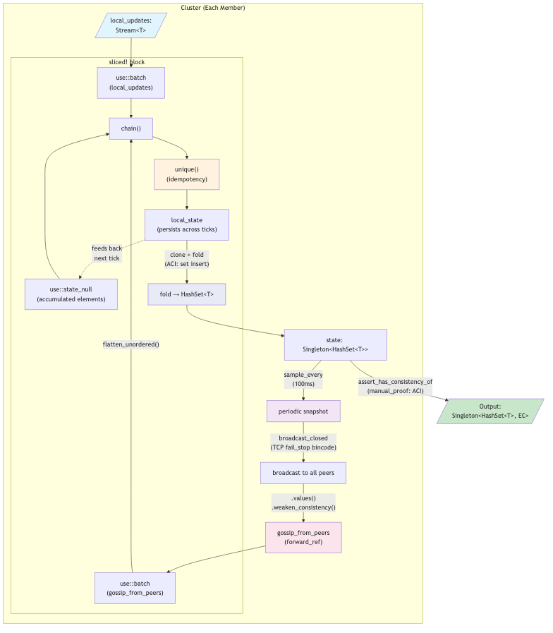

# CRDT Gossip (State-Based G-Set) — Dataflow Diagram

## Protocol Summary

This is **state-based** CRDT gossip — each member maintains a full G-Set and periodically ships its entire state to peers, rather than shipping individual operations.

1. **Inputs** — Each member receives `local_updates` (new elements to insert) and `gossip_from_peers` (full HashSets from other members, via `forward_ref` cycle).

2. **sliced! block** — Batches local writes and received gossip nondeterministically. Chains them with the accumulated `state_null` elements, deduplicates with `unique()`, and folds into a `HashSet<T>` with an ACI-proven merge (set insert is commutative + idempotent).

3. **State persistence** — `use::state_null` accumulates all elements across ticks. Each tick chains new writes + received gossip onto the existing set.

4. **Periodic broadcast** — `sample_every(100ms)` snapshots the current state and `broadcast_closed` ships it to all peers. The output is weakened to `NoConsistency` before completing the `forward_ref` (because `sample_every` drops consistency).

5. **EC assertion** — The final output carries `EventualConsistency` via `assert_has_consistency_of(manual_proof!(...))`, justified by ACI properties of set union: all members converge regardless of gossip timing or ordering.

## Key Differences from Op-Based (`reliable_broadcast_closed`)

| Aspect | Op-based (old) | State-based (this) |
|--------|---------------|-------------------|
| What's shipped | Individual elements | Full `HashSet<T>` state |
| Dedup mechanism | `unique()` on element stream | `unique()` on accumulated elements |
| EC source | Inferred from `broadcast_closed` + `fail_stop` | `manual_proof!` on ACI algebra |
| Cycle purpose | Echo unseen ops to all peers | Periodic full-state gossip |
| Consistency in cycle | EC throughout | `NoConsistency` (sample_every drops it) |
| Tolerates lossy? | No (needs fail_stop for EC) | Yes (periodic re-send of full state) |
| Output type | `Stream<T, EC>` | `Singleton<HashSet<T>, EC>` |
