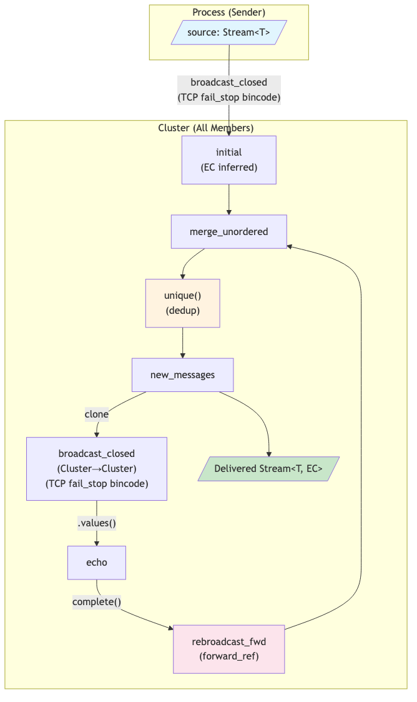

# Reliable Broadcast — Dataflow Diagram

## Protocol Summary

1. **Initial broadcast** — Sender broadcasts message `m` to all cluster members via `broadcast_closed` (Process → Cluster). EC is inferred from the `fail_stop` network policy.

2. **Forward ref cycle** — A `forward_ref` creates the feedback loop on the EC-typed location.

3. **Merge** — Each member merges messages from the initial broadcast with re-broadcasts received from other members.

4. **Dedup** — `unique()` ensures each message is processed only once per member.

5. **Re-broadcast (echo)** — New (unseen) messages are re-broadcast to all members via another `broadcast_closed` (Cluster → Cluster), closing the cycle.

6. **Deliver** — The deduplicated `new_messages` stream is the output. Every correct member eventually sees every message (Agreement property).

## Complexity

- **O(n²) messages** per original message (every member echoes to every member)
- Terminates because `unique()` suppresses re-processing of already-seen messages
